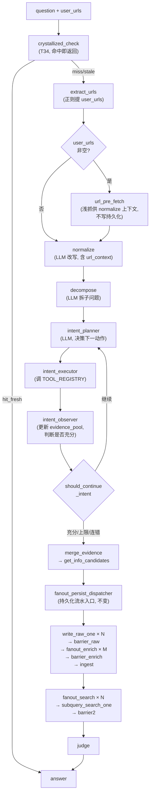
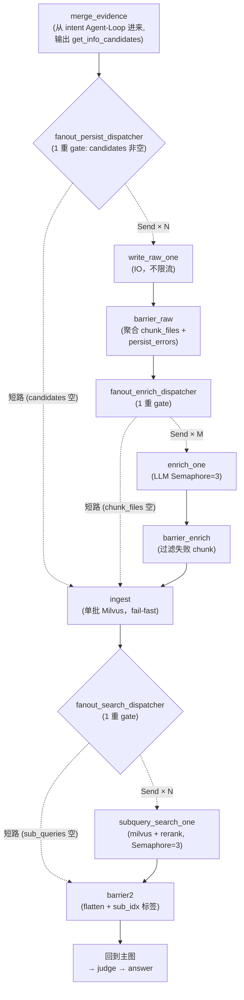

# CLAUDE.md

## LangGraph 重构任务管理规则

- **ToDo.md 驱动**：所有重构任务记录在项目根目录 `ToDo.md`，状态为 `pending` / `executing` / `finished`——防止跨会话丢失进度。
- **执行前写详细计划**：每次将 `pending` 转为 `executing` 时，必须新建一个执行计划文档，写明详细改造步骤（要改哪些文件、新增哪些文件、验证标准）——防止执行中偏离目标。
- **执行前技术审查**：执行任何任务前，先识别技术风险点（依赖关系 / 回归面 / 有争议的设计决策 / 兼容性陷阱 / 测试盲区），确认每项风险都有对应缓解策略；同时清点工作量量级，过大时拆子任务——防止低估复杂度或忽视关键风险导致半途而废。
- **完成后写 finished**：任务完成后回到 `ToDo.md` 标记 `finished`，简要写明实际产出（新增/修改了哪些文件）——下一个 Agent 能看到已完成的内容。
- **参考 brain-base-backup**：每次补充能力前，先去 `../brain-base-backup/` 确认原项目是否有该能力，有则迁移而非重写——防止遗漏已有功能。
- **参考 TradingAgents**：LangGraph 架构模式（graph setup / conditional logic / propagator / checkpointer / state 定义）参考 TradingAgents 项目，不要凭空设计——防止偏离 LangGraph 最佳实践。
- **LangGraph 重构前必须先定 State + Node 字段契约**：每次重构 LangGraph 图（新增 / 删除 / 合并节点、改字段名、改节点间传递结构）前，必须先在 `md/research/` 下写"节点输入/输出字段 + State 字段定义 + 节点流程图"的接口契约文档（表格形式），经用户确认后再动代码——防止边写边改字段名、State schema 与节点实际读写字段不对齐、同一概念在不同节点叫不同名字（如 `sub_queries` vs `sub_questions`、`lexical_hits` vs `grep_hits`）。
- **新阶段开启前整体归档**：每次开启新阶段（即将把第一个 `pending` 转为 `executing`）前，先用 `Move-Item ToDo.md md/archive/ToDo-Phase-{起始任务号}-{结束任务号}.md` 把当前 ToDo.md 整体归档，再新建只含 pending 的 ToDo.md——保留历史决策上下文供下个 Agent 回溯，防止失去问题排查的来龙去脉。
- **禁止 edit 改旧任务条目**：归档前不要用 edit 工具修改已 finished 的旧任务（包括"清理"、"压缩"、"删冗余"），只能用 `Move-Item` 命令式整体搬运——edit 改了就回不去原始决策内容了。同阶段内 pending → executing → finished 的状态推进可以 edit，但任务条目本身不能删。
- **任务编号 = 优先级位置**：编号越小优先级越高、越靠前；新加入的高优先级任务可以**插队**到合适编号位置，后面的低优先级 pending 任务编号**順延**（只重排 pending，finished 任务编号不可变）——防止低优先级任务几个阶段后仍占据靠前位置、高优先级任务被挤到后面被遗忘。

每条规则一句话说明要解决什么问题。

## 通用编码规则

1. **禁止写入仅当前上下文可见的内容**：改进项目时，不要往文件里写"修改了什么""对比之前如何"等依赖旧状态才能理解的内容——其他上下文的 Agent 看不到旧状态，这些信息对他们只是噪音。
2. **先想再写**：假设不明确就问，多种理解就列出，有更简单方案就说——避免基于错误假设写出一大段要重来的代码。
3. **只写解决当前问题的最少代码**：不加没要求的功能、不抽只用一次的抽象、不处理不可能发生的错误——200 行能缩成 50 行就该缩。
4. **只改必须改的**：不顺便"改善"相邻代码、不重构没坏的东西、匹配已有风格——每行变更必须能追溯到用户请求。
5. **目标驱动**：把任务变成可验证的成功标准，循环执行直到验证通过——弱标准（"让它能用"）需要反复确认，强标准可以独立循环。
6. **不改无关功能**：当前指令只改功能 A 时不要动功能 B——已完成且正确的功能改动容易引入回归。
7. **注释用中文 UTF-8**：生成的注释必须用中文，文件编码 UTF-8——项目面向中文用户。
8. **中文输出需检查乱码**：生成中文后必须确认无乱码，有则修正——部分环境下默认编码不是 UTF-8 会导致中文损坏。
9. **改函数先理解再叠加**：修改函数前先理解原实现逻辑，在原逻辑基础上叠加修改，不要移除已有逻辑——避免丢失已验证的正确行为。
10. **重叠内容三步处理**：发现多个 skill/文件有重叠内容时，必须按序执行——①判断重叠并明晰职责归属（谁该做、谁越界）；②对比各版本差异，取长补短合并到职责正确的那个；③删除越界方的冗余定义，只保留引用。禁止跳过对比直接删改，否则会丢失更完善的版本。
11. **讲解架构必须举例模拟实验**：解释 graph / 流水 / 状态机 / 算法时，默认带一个具体输入例子贯穿全程，逐节点展示「输入字段 → 中间 state 变化 → 输出字段」；开头必须明确**「本例要讲解什么问题」**（设计动机 / 关键决策的依据 / 容易踩的坑）。不只画流程图或列字段表——抽象描述容易让设计意图飘忽，具体状态流转才能暴露字段对齐 / 短路条件 / 边界情况的真实行为。举例优先用能贯穿全链路的典型输入（如多意图问题能同时耑 decompose / fanout / barrier / get_info_block / PIPE2）。
12. **不在 PowerShell 临时改环境变量**：禁止用 `$env:VAR = "value"` 临时改 shell 环境——session-scoped 行为不可复现、其他 Agent 会话看不到、批量跑时容易漏。配置项必须改 `.env` 文件让 `dotenv` 自动加载，或给 CLI 加显式参数（cli 内部可 `os.environ[...] = ...` 设 Python 进程内变量，不污染外部 shell）；测试脚本同理用 `load_dotenv` 不用 `$env:`。
13. **多问题专注 + 暂存避免压缩丢失**：用户同一轮抛多个独立问题时，禁止 `ask_user_question` 一次塞多个并行决策（用户 skip 率高、分裂注意力）——只挑最高优先级的一个先解决，**其余问题立即追加到 `ToDo.md` pending 区作占位条目（即便信息不全也先落，标注「待诊断/待用户补充」）**，再继续手头任务。原因是 windsurf 上下文压缩 / checkpoint 会丢失只挂在对话里的"等会儿处理"问题，**只有写到磁盘才能跨 checkpoint 存活**。
14. **LLM 测试必须真调（默认 Minimax）**：测试 LLM 节点语义行为（normalize / decompose / rewrite / judge / answer / self_check / fetch_extract LLM 评估 / enrich 等）**禁止用 mock / `_FakeLLM` / `CapturingLLM`**——mock 只验字段透传，无法验 prompt 是否让 LLM 真的输出预期改写，给虚假安全感（5/5 全绿但 prompt 改一字不差也会过）。**默认 provider 用 Minimax**（成本低、推理强、Anthropic-compatible），GLM 可选。**禁止 `@pytest.mark.requires_llm` 默认跳过 / `pytest.skip` LLM 缺失**——LLM 测试是核心必跑，缺 key 应 fail 不应 skip。**唯一 mock 例外**：测试图编译 / 拓扑结构本身（不触发任何 LLM 节点 invoke）可用 `mock_llm` sentinel（sentinel 一旦被调用就 raise，强制暴露错误）。**配套硬约束**：Agent 节点需要 LLM 时**禁止加"LLM 缺失走降级路径"**——LLM 是 Agent 核心依赖，缺失即 fail-fast（生产代码侧已落实于规则 11 / T27 fail-fast：节点工厂不接受 llm=None）。
15. **禁止命令行 `-c` 直写代码**：禁止用 `python -c "..."` / `node -e "..."` 这类把多行代码塞进命令行的方式跑——shell 转义/编码（尤其 Windows PowerShell 中文注释）容易让代码静默损坏、无法 diff、无法复跑、其他 Agent 看不到执行上下文。**所有代码必须落盘成脚本文件**（`tests/e2e/*.py` / `scripts/*.py` / `bin/*.py`），再用命令行执行该脚本——脚本可被多次复跑、可 git diff、可被引用。简短的 `python -c "import X; print(X.__version__)"` 这类**单行 import 验证**例外允许，但**任何业务逻辑/测试逻辑/多语句必须落盘**。

## Agent 调度约束

6. **upload-agent 禁止并行**：MinerU 单文件峰值 ~14GB VRAM，16GB 显卡同一时刻只能跑一个——N 个文件必须一次调用顺序处理，严禁拆成 N 个并行任务导致 OOM。
7. **其他 agent 默认允许并行**（get-info / qa / organize 等不占 GPU），除非该 agent 自身标注"禁止并行"。

## 项目硬约束

8. **embedding 默认 bge-m3 hybrid**：sentence-transformer dense-only 在中英混合语料下召回弱且无 sparse 通道，已切到 bge-m3。
9. **pymilvus sparse 必须用 `dict[int, float]`**：scipy sparse 矩阵切片 shape 仍是 2D，pymilvus 不认，会抛 `expect 1 row`。
10. **短文不切分**：正文 ≤5000 字符整篇 1 块，>5000 才按语义切——防止短笔记被切成背景不全的碎片。
11. **不镜像文件系统数据到 SQL**：frontmatter + 文件系统本身是可 grep 索引，冗余 SQL 表只会造成职责重叠和同步负担。
12. **数据写入职责单一**：`keywords.db` / `priority.json` 写入归 `update-priority`，`knowledge-persistence` 不能越界——两个 skill 写同一张表是架构坏味道。
13. **引用字段前先定义**：skill 文本引用配置字段时 schema 里必须已存在，悬空引用会导致运行时找不到。
14. **新层必须软依赖**：固化层（crystallized）损坏/缺失时静默降级到 RAG 主链，绝对不能阻断问答。
15. **所有 agent 强制 TodoList**：LLM 倾向跳步，必须第一步生成 todo、按序执行、每步标记 completed——跳步是固有缺陷，TodoList 是唯一硬约束。
16. **subagent（-p 模式）无法与用户交互**：任何需要"问用户确认"的设计在 -p 模式下都会失效，固化写入是自动的不需要询问。
17. **上传路径独立于 get-info**：upload-agent 与 get-info-agent 平行，故障隔离——MinerU 挂不影响爬网页，Playwright 挂不影响本地上传。
18. **上传路径不调 update-priority**：没有 URL/搜索/站点优先级可更新，强行复用只会污染 `priority.json` 和 `keywords.db`。
19. **frontmatter `url:` 不写 `""`**：解析器 `split(":",1)[1].strip()` 不去引号，字面量 `""` 会当值写入 Milvus——冒号后留空即可。
20. **drop-collection 必须 --confirm**：切换 provider 后需 drop 旧 collection 重 ingest，`--confirm` 防误操作。
21. **mermaid 图表默认 sequenceDiagram，用户明确要求"流程图"时豁免改用 flowchart**：流程图节点多时连线杂乱难读，所以默认用时序图（sequenceDiagram）展示参与者交互；但用户明确指定"流程图"时遵从用户要求改用 flowchart（如展开某节点内部分支结构时流程图更直观）。中括号内容必须用双引号包裹（`participant X as "名称"` / `N["名称"]`），否则大概率渲染失败。
22. **Amazon 不走 Cloudflare**：Amazon 有自己的 CDN/DDoS 防护（AWS Shield / CloudFront），`solve_cloudflare=True` 只会多耗 5-15 秒甚至超时且无收益。
22.1. **所有网页信息获取统一走 Playwright + 反爬措施**：抓页面 / SERP（Google / Bing）/ 浅抓 user_urls / GitHub raw / GitLab raw / arXiv abs / RFC txt / PDF 拉取等任何取外部网页内容的入口都必须经 `brain_base/tools/web_fetcher.py` 的 Playwright async 单例（含 stealth JS 注入、`--disable-blink-features=AutomationControlled` launch args、真实 Windows Chrome UA、`zh-CN` locale + `Asia/Shanghai` timezone、auto-scroll 8 轮触发懒加载、网络归档落盘、默认有头）。**禁止使用 `httpx` / `urllib.request.urlopen` / `requests.get` / `aiohttp` 等任何裸 HTTP 客户端直接抓取页面内容**——不带反爬就算静态文件 GitHub/arxiv 也容易被 CDN/WAF 拦或被风控判定异常。例外仅限"基础设施可达性 HEAD 探测"（如 `bin/milvus_config.py` 的 HuggingFace endpoint 探测，不取页面正文，只验证连通性），其他抓取一律绕回 `web_fetcher`。`raw_text_extractor` 这种白名单短链路仍可保留它的 URL 路由 / README 探测 / arxiv meta 解析逻辑，但底层 HTTP 拉取必须委托给 `fetch_page_sync` / `fetch_page`（详见 T48.0）。
23. **审核与执行必须分离**：同一 LLM 既执行又审核会敷衍通过，audit 必须是独立 agent 且只报告不修复——修复责任交 orchestrator 重新触发执行。
24. **流水线禁止中途询问用户**：收到触发后必须从头执行到底，报错记录后继续推进，不得在任何步骤暂停等待用户确认——适用于所有 agent。
25. **实现阶段 fail-fast，不是项目静态边界**：fail-fast 是开发原则——**哪个阶段在实现，那个阶段触及的代码就尽量不用 try-except**。不要把"哪些文件/模块属于 fail-fast 范围"当成豁免边界（"业务隔离" / "软依赖" / "第三方调用兜底" / "保持向后兼容" 这类说辞都是糊弄）。能第一时间报错就第一时间报错，try-except 会隐藏真实问题导致后续排障困难。判定标准：**当前阶段写的或修改的代码默认 fail-fast**；保留 try-except 必须有明确不可替代的设计理由（如 fan-out 单 Send 失败隔离、LangGraph runtime 限制等），且要在阶段执行计划文档里逐条列出说明。**所有保留下来的 try-except 必须 logger 打错误信息**（含异常类型 + message 截断 + 关键上下文如 url / chunk_file / sub_idx），不能 silent 吞或返回空白结果——log 是排障的唯一抓手。已 finished 的旧阶段代码各自归该阶段判断，下个阶段触及它们时一并按 fail-fast 重审。
26. **调试 HTML 解析先读 raw HTML**：BS4 `select_one` 可能遗漏后续同 ID 容器，用它验证自己没意义——先确认源数据完整，再排查解析逻辑。
27. **选择器和正则面向开放集合**：不要枚举已知值（如 `module-N` / `brand-story-*`），用通用模式一次性覆盖，否则每遇到新前缀就要改代码。
28. **Windows 下外部子进程优先用 `subprocess.Popen`**：`asyncio.create_subprocess_exec` 在 Windows 上可能抛 `NotImplementedError`，不要想当然使用。
29. **错误信息端到端透传**：链路中任何一层不得把真实错误降级成“未知错误”或空字符串，否则排障被无意义信息阻塞。
30. **外文内容必须翻译为中文**：项目面向中文用户，英文/日文等外文入库时必须翻译为中文——翻译允许但不得删减、概括或遗漏章节，翻译后正文字符数不得低于原文的 80%（翻译后中文字符数通常与英文相当或更多，低于 80% 说明有内容被删减）。

## QA 主流程框架（统一意图识别 Agent — T47 重构后正式架构）

### 关键架构原则（与下方 "Agentic RAG 规则" 配合理解）

- **统一意图识别 Agent**：删除 `plan_type` / 三路分流（parallel / iterative / direct_url）/ classify_plan 节点；所有证据收集走单一 Agent-Loop（`intent_planner → intent_executor → intent_observer ↺ should_continue_intent`）；该 Agent 看完所有输入（`question` / `sub_questions` / `user_urls` / `url_pre_fetch_content` / `evidence_pool` / `visited_urls` / `iteration_count`）自主决策下一动作。
- **user_urls 是 state 字段不是分流标志**：用户提供的 URL 仅作为 state 进入 intent_planner 决策池，禁止 if-else 根据 user_urls 跳过意图识别 Agent——这是 T46 misfire 的根因。
- **url_pre_fetch 是改写辅助**：crystallized_check miss 出口 + user_urls 非空时浅抓一次（不写持久化、不调 LLM 评估、不进 evidence_pool），结果仅供 normalize 改写时作为上下文理解用户真实意图。失败软依赖降级到只看 question（项目硬约束 14）。
- **TOOL_REGISTRY（T47.3a 落地）**：intent_executor 唯一调用入口；当前注册 4 个工具——`web_search`（Google + Bing SERP）/ `fetch_url`（指定 URL → HTML → Markdown → LLM 评估）/ `raw_text`（GitHub / GitLab / arXiv abs / RFC 直取纯文本）/ `local_search`（Milvus 本地知识库 hybrid 检索）；T48 新增 `arxiv_pdf` / `github_raw` 时只需在 `qa_tools.py:TOOL_REGISTRY` 注册即可被 intent_planner 选择，不动主图。
- **持久化流水 + PIPE2 完全保留**：`fanout_persist_dispatcher` 及之后（write_raw_one / barrier_raw / fanout_enrich / enrich_one / barrier_enrich / ingest / fanout_search / subquery_search_one / barrier2）完全保留 T26.1 + T28 设计，不动一行。
- **rewrite + sparse gate 已废**：T47 删除 PIPE1（rewrite / sparse gate / barrier1 / fanout_prep），子问题改写在 normalize / decompose 阶段一次性完成；是否需要外检由 intent_planner 在循环内基于 evidence_pool 充分性自主决策，取代 sparse gate 的 needs_get_info 信号。

## 持久化流水 + PIPE2 内部展开（merge_evidence → fanout_persist → ingest → PIPE2）

`merge_evidence` 输出 `get_info_candidates` 后接持久化流水（T26.1）+ PIPE2（T28）。T47 重构后这段完全保留，只是入口从原 `barrier_extract` 改为 `merge_evidence`，下游字段格式完全一致。

### 关键约束

- **content_sha256 是内容指纹（双语义，T47 后仍用）**：**QA 路径**在 TOOL_REGISTRY 工具内部（`web_search` / `fetch_url` / `raw_text` 共用 `qa_get_info.py::_fetch_and_evaluate` helper）markdown 转好之后立即调 `compute_body_sha256(markdown)`（CRLF 归一化 + strip + 64 位 hex），查重用 `hash_lookup`（按重算 body SHA-256 建索引）。**upload 路径**在 `convert_node` 顶部对 **PDF 原始二进制文件**调 `_compute_file_sha256(pdf_path)`，查重用 `_lookup_by_frontmatter_sha256`（扫 raw md frontmatter 声明值比较，**不用 `hash_lookup`**）。两条路径共用 `content_sha256` 字段名但语义不同。**存储位置是 `data/docs/raw/` 文件系统 frontmatter，不镜像到 Milvus**（规则 11）。
- **hash_lookup 命中 → short-circuit 丢弃**：调 `hash_lookup(content_sha256)` 查 raw 目录已有文档，命中则在 TOOL_REGISTRY 工具内 `logger.info` 记一行并返回空 candidate——命中 = 内容已在 Milvus 里，QA 主流程后续 `fanout_search` 阶段天然召回；丢弃 candidate 避免"更新 fetched_at"这种没人消费的副作用。
- **merge_evidence 之后是 5 节点持久化流水**（T26.1 落地，T47 后入口节点从 barrier_extract 改为 merge_evidence，下游不变）：`fanout_persist_dispatcher (1 重 gate: candidates 非空) → write_raw_one × N (Send) → barrier_raw → fanout_enrich_dispatcher (1 重 gate) → enrich_one × M (Send，独立 Semaphore=cfg.enrich_concurrency=3) → barrier_enrich (过滤失败) → ingest (fail-fast 单批 milvus_cli.ingest_chunks) → fanout_search_dispatcher (T28 PIPE2 入口)`。dedup 已在 `_fetch_and_evaluate` helper 内 `hash_lookup` 命中后 short-circuit 完成（返 None 让 executor 翻译为 markdown 空，observer 不计入 evidence_pool），持久化流水里不再有 dedup 分支。
- **write_raw_one 不限流**：IO 操作（文件写 + chunker subprocess），candidates ≤ 6，全 fan-out 并发即可。
- **enrich_one 独立 Semaphore**：与 TOOL_REGISTRY 工具内 `_sem` 完全独立，避免两阶段串行执行时计数污染；enrich 失败重试 1 次仍失败 → `inject_enrich_error` 写错误标记到 chunk frontmatter，barrier_enrich 过滤掉这种 chunk 不入 Milvus。
- **ingest fail-fast**：`milvus_ingest_chunks` 抛错直接透传（规则 25），让整个 QA 报错而非吞掉；`enriched_chunks` 空（全部 enrich 失败 / 上游全部失败）→ 不调 Milvus，返回 `ingested_count=0`，主图继续走 PIPE2。
- **新入 chunks 当次问答即可召回**：ingest 完成后才走 PIPE2 第二段子图（每子问题 milvus + rerank），新 chunks 进了 Milvus 后立即被本次 QA 的 `subquery_search_one` 召回到 evidence。
- **doc_id 约定（T26.1）**：URL slug 化 + 日期 + 内容 hash 8 位（`{host-with-dashes}_{path-with-underscores}-YYYY-MM-DD-{8 hex}`），与现有 ingest_url 路径同模式，**不引入** `web-` 前缀。
- **PIPE2 每子问题独立 top-K（T28）**：`fanout_search_dispatcher` 按 sub_idx 发 N 个 Send 到 `subquery_search_one`，每个子问题独立走 `multi_query_search(use_rerank=True)` 拿 top-10——避免扫平搜索被强子问题霸榜问题。rerank 软依赖在 `bin/milvus-cli.py:rerank` 内部封装（reranker=None 静默回退 RRF top-K），节点本身不处理。
- **PIPE2 fan-out 隔离（T28）**：`subquery_search_one` outer try/except 属于规则 25 允许的「fan-out 单 Send 失败隔离」；必须 `logger.warning("subquery_search_one fan-out fail: sub_idx=%s sub_question=%s exc=%s: %s", ...)` 不能 silent；错误以 `{error: ...}` 透传到 `barrier2` 聚合到 `search_errors`。
- **barrier2 按 sub_idx 排序 flatten（T28）**：`sub_evidence` reducer add 拼接后按 sub_idx 升序展开，每个 chunk 加 `sub_idx / sub_question / source / match_type` 标签写入主图 `evidence`——answer 节点可按子问题分组渲染不互相污染。

## Upload 路径（IngestFile 图）硬约束

> 流程：`convert_node` → `frontmatter_node` → `doc_enrich_node` → `chunk_enrich_node` → `ingest_node`。代码在 `brain_base/nodes/ingest_file.py` + `brain_base/nodes/persistence.py`。

53. **upload dedup 必须在 convert 之前**：MinerU 单文件 30+ min，dedup 必须在 `convert_node` 顶部用 `_compute_file_sha256(pdf_path)` 算 PDF 二进制 SHA-256 预检，命中 `_lookup_by_frontmatter_sha256` 直接 short-circuit 跳过转换——禁止等 convert 完再查重。
54. **upload 路径禁用 `hash_lookup`**：`hash_lookup` 内部 `_build_hash_index` 按重算 markdown body SHA-256 建索引，但 upload 路径 frontmatter 里的 `content_sha256` 是 PDF binary SHA-256（两者不可能相等），用 `hash_lookup` 查永远 miss。必须用 `_lookup_by_frontmatter_sha256`（直接读 frontmatter 声明值比较）。
55. **upload Milvus 入库必须 `replace_docs=True`**：重跑同 doc 必须先按 doc_id 删旧 milvus 行再插新行——追加模式产生重复 chunk（同 doc_id × 多份），污染检索召回 + 扭曲 sparse 词频。QA 路径 `qa_persist.ingest_node` 不加（QA 处理新 candidate，doc_id 不撞车）。
56. **大 PDF 分批必须支持断点续跑**：`_convert_pdf_in_batches` 每 batch 开跑前检测已有合法产物（`_find_mineru_output` + size > 100B），有则复用跳过 MinerU；`_find_mineru_output` 抛 `FileNotFoundError` 时 catch 视为产物缺失，rmtree 后重跑该 batch——30+ min 大 PDF 中途崩了只重跑失败 batch 而非从头。

## Agentic RAG 规则

31. **multi-query-search 默认加 --rerank**：RRF 只做位置融合不做语义重排，bge-reranker-v2-m3 cross-encoder 在 RRF 后对 (query, summary) 打分重排能显著提升 top-k 精度——软依赖，模型不可用时静默回退，不报错。
32. **复杂问题必须分解再检索**：多部/对比/因果链/方案选型四类问题，直接用 L0-L3 改写检索会因子意图互相干扰导致证据稀疏——先拆成 2〇4 个独立子问题，各自走改写+检索，再合并证据回答。
33. **简单问题不分解**：单一事实性问题强行分解只会增加检索轮次和延迟——只有含 ≥2 个独立子意图的问题才走分解路径。
34. **答案生成后必须自检**：LLM 生成答案后不做评估就返回，忠实度/完整性/一致性无法保证——Maker-Checker 循环：生成后自检三维度，不合格则修正一轮，最多一轮，失败不阻断。
35. **自检只删不增**：自检修正答案时只能删除无证据断言或标注遗漏，不能凭空添加证据中不存在的内容——自检不是二次生成，是质量把关。
36. **降级模式跳过自检**：降级答案本身已标注不可靠，自检无意义——自检只在有合格证据的正常模式下执行。
37. **reranker 用 summary 不用全文**：cross-encoder 对 (query, chunk_text) 打分，chunk_text 取 summary 字段比完整正文短，推理快——summary 缺失的候选跳过重排，不报错。
38. **子问题独立检索后合并证据**：每个子问题各自走 L0-L3 → 检索，收集各自的证据集，最后合并到同一张候选表——不允许子问题之间交叉引用证据，避免证据污染。
39. **user_urls 是 state 字段不是分流标志（T47 核心原则）**：用户提供的 URL 进入 intent_planner 决策池而非触发独立通道，禁止 if-else 根据 user_urls 跳过意图识别——这是 T46 misfire 的根因。任何处理路径（SERP 检索 / URL 深挖 / 同域子链接抓取 / 多源汇总）都必须是 intent_planner 主动选择的工具调用，不能是流程控制信号。
40. **intent_planner 决策范围**：看 question + sub_questions + user_urls + url_pre_fetch_content + evidence_pool + visited_urls + iteration_count 全量输入，自主选择 TOOL_REGISTRY 中的工具，可串行或并发执行；early_exit 信号由 intent_observer 综合 should_continue_intent 5 级早退判断（consecutive_errors / sufficient / max_iterations / no_action / 正常）。
41. **url_pre_fetch 不进入证据池**：URL 浅抓内容仅作 normalize 改写上下文，不写 raw 文件、不入 Milvus、不调 LLM 评估，**不进 evidence_pool**——若 intent_planner 需要 URL 内容作证据需自行调 fetch_url 工具显式获取（避免改写辅助内容污染证据池语义）。

## 故障排查顺序

ingest 失败 / 检索不对时按序检查：

1. `docker compose ps` → Milvus `(healthy)`
2. `python milvus-cli.py check-runtime --require-local-model --smoke-test` → `dense_dim` / `sparse_nnz` / `resolved_mode`
3. `python milvus-cli.py inspect-config` → `embedding_provider` 含 `kind` / `question_id`
4. dense dim 不匹配 / 缺 sparse 字段 → `python milvus-cli.py drop-collection --confirm` 后重 ingest
5. `expect 1 row` / `invalid input for sparse float vector` → sparse 值必须是 `dict[int, float]`

## 外部调用与部署规则

39. **外部调用统一走 `bin/brain-base-cli.py`**：禁止外部 Agent 直接拼装 `claude -p ... --plugin-dir ... --agent ...`，所有外部调用必须经 brain-base-cli——CLI 已封装 UUID 转换、HF 离线模式、stream-json 实时输出、会话落盘等通用逻辑，绕过会重复踩坑。
40. **Docker 是个人/本地部署主路径**：`docker compose up -d` 一键拉起 Milvus + brain-base 容器；裸装 Python + Node 仅用于开发调试。Dockerfile 必须把 nodejs、claude code、playwright Python SDK + chromium 浏览器、Python 依赖、bge-m3 / mineru 模型缓存全部就位（playwright-cli 子进程方案已弃用，改用 sync_playwright 单例 + 反检测 stealth context 直驱浏览器）。
41. **模型缓存必须挂载持久卷**：bge-m3 ~1.4GB、MinerU ~2GB，容器重建若不挂载 `~/.cache/huggingface` 会重复下载——`docker-compose.yml` 必须把宿主机 cache 目录挂进容器。
42. **多轮对话用 `--resume <session_id>`**：claude-code 原生支持 session 续接，禁止在 brain-base 层自建会话上下文管理；`ask` 落盘到 `data/conversations/<session_id>.jsonl`，`resume` 命令直接复用该 session_id。
43. **会话历史是只读追加日志**：`data/conversations/*.jsonl` 每行一个事件（ask/resume/feedback），禁止改写历史行——回溯靠读 jsonl，不要再造索引数据库。
44. **文档生命周期管理走 `lifecycle-agent`**：删除/归档/重 ingest 等破坏性操作必须通过 lifecycle-agent 编排（`brain-base-cli remove-doc` 调它），禁止任何 skill / 后端代码直接 `rm` raw 文件或 `collection.delete()` ——agent 层负责跨存储一致性（Milvus / raw / chunks / doc2query-index / crystallized 联动清理）。
45. **organize-agent 不删原始层**：固化层（crystallized）的清理由 organize-agent 负责，原始层（raw / chunks / Milvus）的清理只能由 lifecycle-agent 负责，两者职责严格分离。
46. **remove-doc 必须 dry-run 先行**：默认列出将删除的内容（Milvus 行数、raw / chunks 文件路径、被引用的 crystallized skill），加 `--confirm` 才真删，且不可逆。

## LangGraph / 模型集成硬约束

47. **LangGraph 节点间传递的字段必须在 State schema 里显式声明，同名 State 类禁止跨文件重复定义**：`TypedDict(total=False)` 默认 reducer 会丢弃未声明字段下游拿空；shadow schema 会让外部 schema 修改对实际 compile 失效——改必须改 graph 实际使用的那份。
48. **LangGraph state 字段必须有 router 消费，mermaid GATE 节点必须有 add_conditional_edges 对应**：写入新 `sub_xxx` 字段后必须能在 `conditional_logic.py` grep 到读它的 router——否则字段悬空成 dead state，旧路径“恰好正确”的偶然性（如 T30 前 grep 全 0 命中→needs_get_info 全 True→无条件去 GI 是对的）会掩盖路由 bug，到下次改造（T30 sparse gate 引入 PASS 路径）才暴露 barrier1 后实际是无条件边；同理 mermaid 流程图画 `GATE{...?}` 节点而 `qa_graph.py` 无 `add_conditional_edges` = 自欺欺人。预防：① 改 conditional_edges 必须 e2e 跑能触发新分支的输入（单测 router 通过 ≠ 实际路由生效），② 写新字段必须 grep 到消费 router。
49. **SLM prompt 超长必须 head+tail 截断保留尾部终结指令**：纯裁尾会丢 `<｜Assistant｜><think>` / `<|im_end|>` 这类结束信号让模型死循环到 `max_new_tokens` 上限；保留头部 `max_input - 128` + 尾部 128 tokens。
50. **HTML 送进 SLM 前必须剥 `<script> / <style> / <noscript> / <iframe> / <svg>` 以及 `<link rel="prefetch|preload|dns-prefetch|preconnect|modulepreload">`**：SPA / 静态站 `<head>` 塞百级 prefetch 链接会挤占上下文窗口把正文 token 挤掉。
51. **Dockerfile 引入新 Python 包前必须 grep 包内 `libxxx.so*` 字符串装齐系统库**：缺 `libcairo` / `libpango` 等 ctypes 依赖时包通常不直接报 SystemError，会被上层改写为"主体为空"/"提取失败"类业务错误带偏排障方向。
52. **自实现 transformers backend 时，Windows 上 `transformers.modeling_utils.caching_allocator_warmup` 必须 monkey-patch 为 no-op，且 `from_pretrained` 后禁止再用 `pipeline(model=..., device_map=...)`**：前者防 WDDM shared GPU memory 被误算为 free 超额预分配，后者防 HF pipeline 二次 dispatch 重复分配显存。
