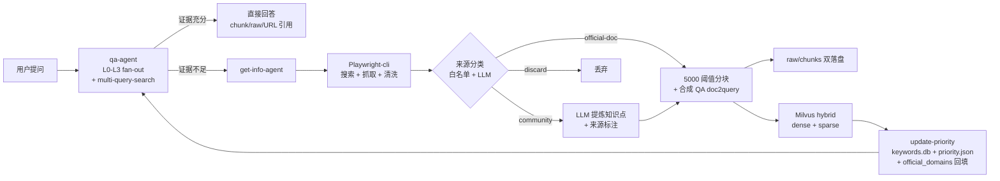
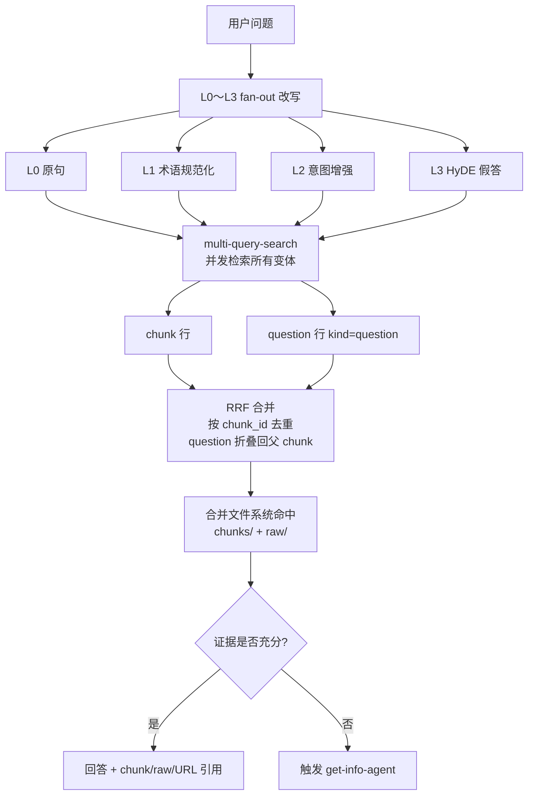
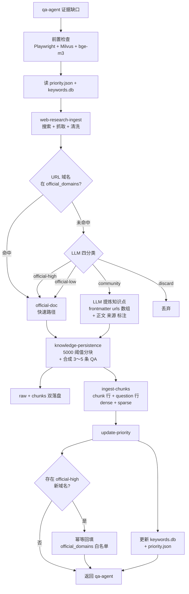

<div align="center">

# knowledge-base

*Claude Code Plugin 的知识库，让Claude Code 也能调用 RAG*

[](https://claude.com/claude-code)
[](LICENSE)
[](https://milvus.io/)
[](https://www.npmjs.com/package/@playwright/cli)

> **Claude-Code-Agent-Plugin** | **QA First** | **Playwright-cli Ingest** | **Milvus RAG** | **MIT License**

</div>

---

## 痛点

你是否遇到过这些问题？

| 场景 | 结果 |
|------|------|
| 问答系统只会“即时回答”，不会长期沉淀 | 同样的问题反复查、反复答，知识无法复用 |
| 只靠向量库，不保留原始文档 | 出现争议时无法审计来源和上下文 |
| 一有新问题就直接联网抓取 | 成本高、慢，而且容易污染知识库 |
| 抓取工具混用、调用不一致 | 流程不可维护，排障困难 |

**knowledge-base** 的核心不是“再加一个检索脚本”，而是做一个可持续运行的知识闭环：

1. `qa-agent` 先本地检索，再决定是否补库。
2. `get-info-agent` 只在证据不足时触发外部抓取。
3. 外部资料必须同时落到 `raw + chunks + Milvus + keywords.db`。
4. `playwright-cli` 统一作为外部网页抓取入口。

---

## 核心思想

本项目坚持两条主线：

1. 回答必须可追溯：答案要能回到 chunk、raw、来源 URL。
2. 知识必须可演进：每次补库都能被后续检索复用。



---

## 核心能力

- **QA Agent**：对用户问题做 L0〜L3 fan-out 改写（原句 / 规范化 / 意图增强 / HyDE），默认只检索本地知识库，再决定是否补库。
- **Get-Info Agent**：作为调度器，基于站点优先级组织 **Playwright-cli** 抓取、清洗、分块、合成 QA 生成和落盘。
- **Playwright-cli**：直接使用官方 `playwright-cli` 命令，遵循官方仓库推荐的安装与调用方式。
- **Milvus hybrid 索引（默认 bge-m3）**：dense + sparse 双路召回，支持 chunk 行 + 合成 question 行（doc2query）。
- **5000 字符分块阈值**：短文档不再被切碎（≤ 5000 字符整篇 1 块）；长文档按 Markdown 语义边界切分。
- **multi-query-search**：把多条 query 变体一次性丢给 CLI，自动并发检索、RRF 合并、按 chunk_id 去重。
- **Skill 工作流**：使用生产级 workflow 约束 Query 改写、证据判断、抓取流程、持久化流程。
- **动态站点优先级**：根据真实命中结果更新 `priority.json` 与 `keywords.db`。
- **非官方来源内容提炼**：博客、教程、问答帖等不整篇入库，由 LLM 提炼有用知识点后重组为带 `> 来源: <url>` 溯源标注的文档，溯源完全保留在文件系统（frontmatter `urls` 数组 + 正文标注），grep 可查，无需额外数据库。
- **官方域名自学习白名单**：`priority.json.official_domains` 作为分类快速通道；LLM 高置信度判为官方的新域名由 `update-priority` 幂等回填，越用越准。

---

## 工作流概览

### QA 流程

1. 接收用户问题。
2. 做 L0〜L3 fan-out 改写，产出 4〜6 条查询变体：
   - **L0** 用户原句
   - **L1** 术语规范化（缩写展开 / 中英别名 / 标准产品名）
   - **L2** 意图增强（动作词 / 步骤词 / 版本词 / 时间词）
   - **L3** HyDE 假答（虚构一段"理想答案的开头"再当查询用）
3. 优先检索本地知识：
   - 先查 `data/docs/chunks/`
   - 再查 `data/docs/raw/`
   - 再调用 `python bin/milvus-cli.py multi-query-search` 把所有变体丢进去做并发检索 + RRF 合并 + 按 `chunk_id` 去重（合成 question 行自动折叠回父 chunk）
4. 把文件系统命中与 multi-query-search 结果做最终合并，优先保留两层都命中的 chunk。
5. 判断证据是否充分、是否过时。
6. 只有当本地证据不足且明确需要新增外部知识时，才触发 `get-info-agent`。



### Get-Info 流程

1. 接收来自 `qa-agent` 的问题、查询变体和证据缺口。
2. 先做前置检查（Playwright-cli、Milvus MCP、本地 bge-m3 模型可用性）。
3. 读取 `data/priority.json` 和 `data/keywords.db`。
4. 调用 `get-info-workflow` 编排子流程。
5. 调用 `playwright-cli-ops` 与 `web-research-ingest` 执行搜索、抓取和初步清洗。
6. **来源分类与内容提炼**：按「白名单 + LLM」两级判定文档属于 `official-doc` / `community` / `discard`；`community` 来源进入提炼流程，按知识点重组为新 Markdown，每个知识点附 `> 来源: <url>` 标注；`discard` 直接丢弃。
7. 调用 `knowledge-persistence` 保存 raw Markdown、按 5000 字符阈值规则做 LLM 分块。
8. **对每个 chunk 调用 LLM 生成 3〜5 条合成 QA 问题**，写入 chunk frontmatter 的 `questions: [...]`。
9. 以 chunk 为单位写入 Milvus（`ingest-chunks` 同时写 chunk 行与 question 行，hybrid 模式下写 dense + sparse）。
10. 更新 `keywords.db` 与 `priority.json`（`update-priority` 同时幂等回填 LLM 高置信度判为官方的新域名到 `official_domains` 白名单）。



---

## 持久化设计

### 为什么同时保留 raw 和 chunks

这个项目不是只做向量库。文件系统也是一等存储层。

1. `raw` 保留完整清洗后的 Markdown，适合审计、复核、保留完整上下文。
2. `chunks` 保留可 grep、可 RAG 的主题化片段，适合精确检索与引用。
3. Milvus 只负责存储与检索，不负责替你凭空生成真实 embedding。

### 分块原则（带 5000 字符硬阈值）

分块由 Claude Code 或 Codex 模型主导，不采用复杂本地分块系统。模型分块时**必须遵守**以下硬约束：

1. **正文 ≤ 5000 字符 → 整篇直接 1 个 chunk，不切。** 这是为了避免短 MD 被无谓地切成多块。
2. **正文 > 5000 字符 → 按 Markdown 语义边界切**，每块上限 5000 字符，目标 2000〜5000 字符/块。
3. 优先按 H2/H3 标题层级切分；其次按步骤组、FAQ 问答对切分。
4. **不得在代码块、表格、命令示例、列表中间硬切**。
5. 单个 chunk 保持主题完整，便于 Grep 和 RAG。
6. 必要时允许 ≤ 200 字符的轻度重叠，但避免重复污染。
7. 极端退化：单一语义块本身 > 5000 字符且内部无安全切点（如超长代码块），才允许字符硬切并标记 `truncated: true`。

### chunk 的目标

一个高质量 chunk 必须同时满足：

1. 单独拿出来也能看懂主要主题。
2. 保留标题路径、摘要、关键词、`questions` 合成问题列表，便于 Grep + 向量化双层召回。
3. 能回溯到 raw 文档和原始 URL。
4. 足够短，避免混入多个无关主题；又足够完整，不至于丢上下文。

### 合成 QA 索引（doc2query）

每个 chunk 落盘前，由 LLM 生成 3〜5 条用户口吻的合成问题，写入 frontmatter：

```yaml
questions: ["如何创建 Claude Code subagent?", "subagent 的 frontmatter 必填字段?", "subagent 与 plugin 的关系?"]
```

`bin/milvus-cli.py ingest-chunks` 会自动把每个问题独立 embedding 入库（行类型 `kind=question`，`chunk_id` 指向父 chunk）。检索时这些 question 行会和正文 chunk 行一起参与 RRF，最后按 `chunk_id` 去重，**显著降低用户口语 query 与文档术语之间的语义鸿沟**。

---

## Milvus 与向量化边界

这是当前项目必须遵守的边界：

1. **Milvus 是向量数据库，不是通用 embedding 生成器。**
2. 稠密向量必须来自能返回 embedding 的 provider。
3. provider 可以是本地 embedding 模型，也可以是在线 embedding API。
4. 只能返回文本、不能返回 embedding 的通用大模型，不能直接替代向量化阶段。
5. 稀疏 / BM25 检索和 dense 检索都应是正式设计的一部分，不能再用伪向量占位。
6. **当前默认 provider 为 `BAAI/bge-m3`**（hybrid，dense 1024 维 + sparse），首次启动需要下载约 1.4 GB 模型。CPU 可跑但向量化较慢；有 GPU 时设 `KB_EMBEDDING_DEVICE=cuda` 显著加速。如需轻量回退到 384 维 dense-only，设 `KB_EMBEDDING_PROVIDER=sentence-transformer`。

---

## Skill 分层

QA 与 Get-Info 调度以下 skills：

1. `qa-workflow`：用户问题接入、L0〜L3 fan-out 改写、multi-query-search 调用、证据充分性判断。
2. `playwright-cli-ops`：稳定调用 Playwright-cli。
3. `web-research-ingest`：搜索、抓取、清洗网页内容。
4. `knowledge-persistence`：5000 字符阈值分块、合成 QA 生成、raw/chunks 落盘、Milvus hybrid 持久化。
5. `get-info-workflow`：编排上述子 skill 的执行顺序与失败策略。
6. `update-priority`：更新关键词和优先级状态。
7. `mengsi16-knowledge-base`：**外部 Agent 调用说明书**——部署在 `~/.claude/skills` 或 `~/.codex/skills`，教其他 Agent 如何通过 `claude -p ... --plugin-dir ... --agent qa-agent --dangerously-skip-permissions` 调起知识库 qa-agent。

---

## 快速启动（已合并 QUICKSTART）

以下命令默认在 `knowledge-base` 仓库根目录执行。如果你当前不在该目录，请先进入该目录；后文 `--plugin-dir .` 中的 `.` 都指当前目录。

如果你希望按“可长期运行、全权限自动化、后台补库策略”来使用，请看完整手册：

- [OPERATIONS_MANUAL.md](./OPERATIONS_MANUAL.md)

### 1. 启动 Milvus

```bash
docker compose up -d
```

验证 Milvus：

```bash
curl http://localhost:9091/healthz
```

### 2. 安装 Python 依赖

以下命令会安装到你当前选择的 Python 环境中。若你使用虚拟环境，请先激活虚拟环境，再执行安装。

```bash
python -m pip install -U "pymilvus[model]" sentence-transformers FlagEmbedding
```

说明：

1. `pymilvus[model]` 提供向量化辅助函数（含 BGE-M3 / SentenceTransformer / OpenAI 三类 wrapper）。
2. `sentence-transformers` 是 BGE-M3 与 sentence-transformer 模型的底层依赖。
3. `FlagEmbedding` 是 BAAI/bge-m3 的官方推理库；首次调用会自动下载约 1.4 GB 模型到 `~/.cache/huggingface/`。

### 3. 准备官方 Milvus MCP Server

1. 安装 `uv`（官方推荐运行方式）。
2. 克隆官方仓库到本项目约定路径：

```bash
git clone https://github.com/zilliztech/mcp-server-milvus.git ./mcp/mcp-server-milvus
```

3. 项目根目录已提供 `.mcp.json`，会按官方 README 推荐的 stdio 方式启动 Milvus MCP。
4. 通过预检命令确认本地向量化能力可用：

```bash
python bin/milvus-cli.py check-runtime --require-local-model --smoke-test
```

### 4. 确认 Playwright-cli 可用（对 Agent 集成场景强制）

`get-info-agent` 的外部抓取链路依赖官方 **Playwright-cli**。调用约束是：优先 `playwright-cli`，其次 `npx --no-install playwright-cli`，不要静默替换成其他抓取器。

1. 安装官方 CLI：

```bash
npm install -g @playwright/cli@latest
```

这条命令会把 `playwright-cli` 安装到全局 Node 环境。

2. 如果要给 Claude Code、Codex、Cursor、Copilot 等 Agent 使用，按官方 README 安装 CLI skills（本项目视为必需步骤）：

```bash
playwright-cli install --skills
```

3. 验证命令：

```bash
playwright-cli --help
```

4. 如果你已经在当前项目里本地安装了 `@playwright/cli`，也可以使用：

```bash
npx --no-install playwright-cli --help
```

### 5. 启动 QA Agent

```bash
claude --plugin-dir . --agent knowledge-base:qa-agent
```

这里的 `.` 表示当前目录，因此这条命令要求你当前就在 `knowledge-base` 仓库根目录。如果你当前在它的父目录，请改用：

```bash
claude --plugin-dir ./knowledge-base --agent knowledge-base:qa-agent
```

#### 如果想完全离手操作

```bash
claude --plugin-dir . --agent knowledge-base:qa-agent --dangerously-skip-permissions
```

### 6. 如果你已安装并启用本插件，也可在 `.claude/settings.json` 中配置默认 agent

```json
{
  "$schema": "https://json.schemastore.org/claude-code-settings.json",
  "agent": "knowledge-base:qa-agent"
}
```

仅配置 `agent` 不会替代 `--plugin-dir .`。如果你是直接从当前仓库目录临时加载插件，仍需使用上一条命令启动。

### 7. 开始提问

本地知识问答：

```text
请告诉我 Claude Code 的 subagent 怎么创建？
```

强制补充外部资料：

```text
请先联网补充最新的 Claude Code 文档，再回答 subagent 怎么创建。
```

---

## 数据与配置

### `data/priority.json`

这个文件维护站点优先级、关键词和上次更新时间。

```json
{
  "version": "1.1.0",
  "update_interval_hours": 24,
  "last_update": "2026-04-12T00:00:00Z",
  "official_domains": [
    "docs.anthropic.com",
    "github.com/anthropics"
  ],
  "sites": {
    "anthropic": {
      "priority": 10,
      "keywords": ["claude-code", "subagent", "plugin"]
    }
  }
}
```

字段说明：

1. **`official_domains`**：官方域名白名单（可为空数组）。`get-info-workflow` 分类非官方/官方来源时先查询白名单，未命中时交 LLM 综合判断；LLM 高置信度判为官方的新域名由 `update-priority` 回填至此数组。仅作为分类加速通道，不是安全边界，用户可随时手动编辑。
2. **`sites.<site_id>.priority`**：站点优先级打分，数值越高检索越优先。
3. **`sites.<site_id>.keywords`**：站点关联关键词，用于关键词补强。

### `data/keywords.db`

记录关键词、站点、查询次数、最后查询时间。它不是替代 `priority.json`，而是为优先级更新提供事实依据。

表结构：

1. **`keywords`**：关键词热度记录（site_id, keyword, query_count, last_query_at）。

提炼来源 URL 不单独入表：它们作为文档元信息直接写在提炼文档的 chunk frontmatter `urls` 字段和正文 `> 来源: <url>` 标注中，溯源通过 grep 或读文件完成。

### 目录结构

```text
knowledge-base/
├── .mcp.json
├── agents/
│   ├── qa-agent.md
│   └── get-info-agent.md
├── skills/
│   ├── qa-workflow/
│   ├── get-info-workflow/
│   └── update-priority/
├── bin/
│   ├── milvus-cli.py
│   └── scheduler-cli.py
├── data/
│   ├── docs/
│   │   ├── raw/
│   │   └── chunks/
│   ├── priority.json
│   └── keywords.db
└── mcp/
    └── milvus-rag/
```

---

## CLI 工具

```bash
# 查看当前 Milvus/provider 配置
python bin/milvus-cli.py inspect-config

# 检查本地向量化模型与可向量化能力
python bin/milvus-cli.py check-runtime --require-local-model --smoke-test

# 把 chunk Markdown 入库到 Milvus（默认追加；hybrid 模式会自动写 dense + sparse；
# 同时会把 frontmatter 里的 questions 列表也作为独立行入库，kind=question）
python bin/milvus-cli.py ingest-chunks --chunk-pattern "data/docs/chunks/*.md"

# 覆盖重写某个文档（先删后写，谨慎）
python bin/milvus-cli.py ingest-chunks --chunk-pattern "data/docs/chunks/claude-code-agent-teams-2026-04-12-*.md" --replace-docs

# Dense 检索（单查询，旧式调用）
python bin/milvus-cli.py dense-search "搜索关键词"

# Hybrid 检索（单查询，bge-m3 dense+sparse）
python bin/milvus-cli.py hybrid-search "搜索关键词"

# 多查询 fan-out 检索（推荐主路径）
# 每个 --query 对应一条 L0/L1/L2/L3 改写；CLI 自动并发检索 + RRF 合并 + 按 chunk_id 去重
python bin/milvus-cli.py multi-query-search \
  --query "claude code subagent 配置" \
  --query "Claude Code subagent configuration" \
  --query "如何创建 Claude Code subagent" \
  --query "Claude Code 的 subagent 通过 .claude/agents 下的 YAML 文件定义..." \
  --top-k-per-query 20 --final-k 10

# 检查是否到达优先级更新时间窗口
python bin/scheduler-cli.py --check

# 更新关键词
python bin/scheduler-cli.py --keyword "claude-code" --site anthropic
```

### Provider 切换与 collection 重建

切换 `KB_EMBEDDING_PROVIDER`（如 bge-m3 ↔ sentence-transformer）会改变 dense 维度与 schema：

1. CLI 在 dim 不匹配或 schema 不匹配时会 fail-fast，不会静默写脏数据。
2. 切换前必须 drop 旧 collection 再重新入库；最简单的做法是删掉 Milvus 里的 collection 再跑 `ingest-chunks`，CLI 会按当前 provider 重建 schema。
3. 默认 provider 已是 `bge-m3`（hybrid，dense 1024 维 + sparse）。若需回退到 sentence-transformer，设 `KB_EMBEDDING_PROVIDER=sentence-transformer`，dense 变为 384 维，sparse 字段为空（dense-only 检索）。

---

## 数据存储警告

> 此 Plugin 会持续把知识写入 `data/` 目录。随着使用时间增长，数据量会不断增加。
>
> 强烈建议把 Plugin 安装在**项目级目录**，不要直接长期堆到用户级全局配置目录。

---

## Milvus MCP

本项目通过插件根目录 `.mcp.json` 接入官方 `zilliztech/mcp-server-milvus`。

接入方式遵循 Anthropic 插件文档中的 MCP 约定：在 plugin root 放置 `.mcp.json`，由 Claude 在加载 plugin 时接入 MCP server。

当前 `.mcp.json` 使用的是官方 README 推荐的 `uv --directory ... run server.py` stdio 方案。

示例：

```json
{
  "mcpServers": {
    "milvus": {
      "type": "stdio",
      "command": "uv",
      "args": [
        "--directory",
        "./mcp/mcp-server-milvus/src/mcp_server_milvus",
        "run",
        "server.py",
        "--milvus-uri",
        "http://127.0.0.1:19530"
      ]
    }
  }
}
```

`mcp/milvus-rag/` 仍保留为项目内适配层，仅用于兼容与迁移，不再作为官方 MCP 替代。

---

## 当前实现状态

本仓库当前已完成：

1. `skills` 与 `agents` 全部提升为生产级工作流定义。
2. 明确 QA 与 Get-Info 的协作边界。
3. raw/chunks 双副本持久化 + 5000 字符阈值分块规则。
4. 默认 BGE-M3 hybrid 入库链路（dense + sparse），`ingest-chunks` 端到端可用。
5. 合成 QA（doc2query）索引层：每 chunk 3〜5 条问题独立向量化入库。
6. multi-query-search CLI：L0〜L3 fan-out + RRF 合并 + 按 chunk_id 去重。
7. 非官方来源内容提炼与溯源标注：白名单快速通道 + LLM 四分类判定 + `update-priority` 自学习回填 `official_domains`，溯源信息全部在提炼文档的 `urls` frontmatter 字段和正文 `> 来源: <url>` 标注中。

如果你后续继续扩展这个项目，建议优先补齐：

1. chunk 质量回归测试与去重策略（自动化校验 5000 字符阈值与 questions 字段完整性）。
2. 评估集（gold queries → expected chunk_ids），跑 multi-query-search 量化召回率。
3. 合成 QA 离线生成脚本（当前由 agent 在写盘前生成；可补一个 `synthesize-questions` CLI 用于历史 chunk 回填）。
