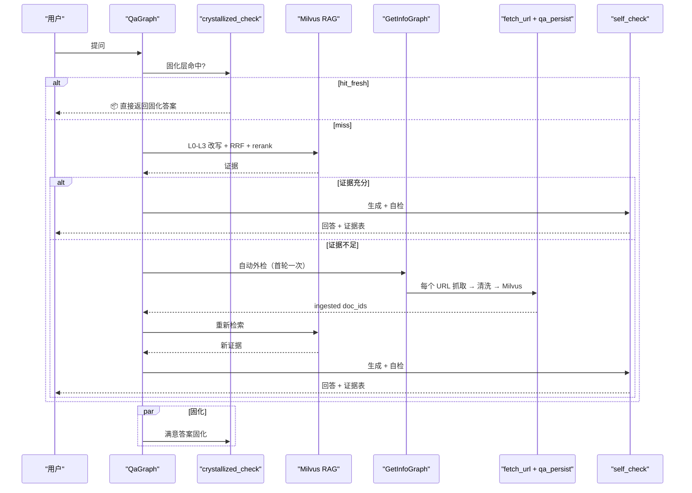

<div align="center">

# brain-base

*LangGraph 驱动的个人知识库：自动检索 / 外检补库 / 固化复用的三层架构 RAG*

[简体中文](./README.md) | [English](./README_en.md)

[](https://langchain-ai.github.io/langgraph/)
[](https://milvus.io/)
[](https://huggingface.co/BAAI/bge-m3)
[](LICENSE)

> **LangGraph StateGraph** | **Docker One-Click** | **Multi-Provider LLM** | **Self-Evolving Crystallized Layer**

</div>

## 痛点

| 场景 | 结果 |
|------|------|
| 问答系统只会"即时回答"，不会长期沉淀 | 同样的问题反复查、反复答，知识无法复用 |
| 只靠向量库，不保留原始文档 | 出现争议时无法审计来源和上下文 |
| 一有新问题就直接联网抓取 | 成本高、慢，而且容易污染知识库 |
| RAG 每次都要重跑全链路检索+综合 | 相似问题答过一遍还要重算，费时又费 token |
| 手头的论文 / PDF / Word / LaTeX 无法直接入库 | 知识库只能等联网补库，本地文档沉不进去 |
| 16GB 显卡跑 MinerU-HTML 一上来就 OOM | 容器隔离 + flash kernel + head+tail 截断后显存峰值 1.1GB |

**brain-base** 的核心不是再加一个检索脚本，而是一个**基于 LangGraph StateGraph 的可持续运行、自进化的知识闭环**：

1. `QaGraph` 先查自进化整理层的固化答案，命中且新鲜直接返回。
2. 未命中走本地 Milvus RAG（bge-m3 hybrid dense+sparse + cross-encoder 重排）。
3. 证据不足时 `GetInfoGraph` 自动外检 → `QaGraph` 的 `fetch_url` 工具 + `qa_persist.write_raw_one`（含 `source_priority`） → 重新检索。
4. 本地文件通过 `IngestFileGraph`（MinerU + pandoc）统一转 Markdown 入库。
5. 生成答案后 Maker-Checker 自检忠实度 / 完整性 / 一致性。
6. 满意问答 `CrystallizeGraph` 固化到 `data/crystallized/`，下次相似问题短路返回。

---

## 5 分钟上手

第一次跑只需 4 步。**只关心怎么用 → 把这一节读完就够了**；想了解 8 个图怎么协作、为什么这么设计 → 继续往下读架构章节。

### 1. 起依赖

```bash
docker compose up -d   # 一键拉起 Milvus 三件套 + brain-base-worker（Python+Node+Playwright+MinerU+bge-m3 缓存）
```

### 2. 配 LLM key

复制 `.env.example` 为 `.env`，填任一 provider 的 key（国内最便宜：MiniMax）：

```ini
BB_LLM_PROVIDER=anthropic
BB_LLM_BASE_URL=https://api.minimaxi.com/anthropic
BB_DEEP_THINK_LLM=MiniMax-M2.7
BB_LLM_API_KEY=sk-xxx
```

### 3. 健康检查

```bash
docker compose exec brain-base-worker python -m brain_base.cli health
```

输出 Milvus / playwright / LLM 三项 ok 即可。

### 4. 第一次问 + 第一次喂

```bash
# A. 空库直接问 → 自动外检（Bing 搜 → 抓页 → 入库 → 回答）
python -m brain_base.cli ask "LiteLLM 是什么？怎么用？"

# B. 持续多轮对话（内存维护历史，自动消解「它/那个/还有别的吗？」等指代）
python -m brain_base.cli chat
# > RAGFlow 是什么？
# ...答案...
# > 它支持哪些文档格式？        # ←「它」自动消解为 RAGFlow
# > /q                          # 退出

# C. 跨进程多轮对话（持久化到 data/sessions/<id>.jsonl，下次同一 id 接着聊）
python -m brain_base.cli ask "RAGFlow 是什么？" --session rag-talk
python -m brain_base.cli ask "它支持哪些文档格式？" --session rag-talk

# D. 主动喂一篇官方文档 → 下次相同问题秒返。
#    问题里出现 URL 时 ask 会自动取证+入库順带回答（T50 后独立的 ingest-url 命令已删，本来也是走 ask 路径的重复设计）
python -m brain_base.cli ask "https://docs.litellm.ai/ 这个文档讲了什么？"

# E. 喂本地论文 / DOCX / MD（自动 MinerU 转 markdown）
python -m brain_base.cli ingest-file --path ./papers/paper.pdf
```

> **日常 90% 操作只需 `ask` / `chat` 和 `ingest-file`**：`ask` 自动串起检索 / 外检 / URL 入库 / 自检 / 固化，你不用记 7 个子图。
>
> 想看更多命令 → 跳到下面 [CLI 用法](#cli-用法)；想让外部 agent 调用 brain-base → 看 `brain-base-skill/SKILL.md`。

---

## 核心思想

1. **回答必须可追溯**：答案要能回到 chunk / raw / 来源 URL。
2. **知识必须可演进**：每次补库都能被后续检索复用。
3. **结果必须可积累**：成功回答过的问题固化下来，相似问题不再重跑 RAG。

**三层架构**：

| 层 | 存储 | 负责写入 | 作用 |
|---|---|---|---|
| **原始层** | `data/docs/raw/` + Milvus（chunks） | `QaGraph` `fetch_url` 工具 + `qa_persist.write_raw_one`（联网补库）/ `IngestFileGraph`（本地文档） | 不可变的原始证据，两条并列入口写入，只补库/修复不改动 |
| **自进化整理层** | `data/docs/chunks/` + `data/crystallized/` | `PersistenceGraph`（chunker + enrichment）/ `CrystallizeGraph`（固化） | chunker.py 生成的 chunks + 固化答案；相似问题短路返回 |
| **调度层** | `brain_base/graphs/` + `brain_base/prompts/` | 维护者 | 6 个 LangGraph StateGraph 控制系统行为 |

---

## LangGraph 图总览

brain-base 所有业务逻辑都落在 **6 个 LangGraph 子图** 上（T50: 原 IngestUrlGraph 删除，URL 入库走 ask 路径；T54: 原 GetInfoGraph 删除，外检走 fetch_extract 链路；T55: BrainBaseGraph 顶层编排层拔除，CLI 直接实例化各子图）：

| 图 | 文件 | 职责 | 关键节点 |
|---|---|---|---|
| **QaGraph** | `graphs/qa_graph.py` | 用户问答全流程（含统一意图识别 Agent-Loop 自动外检） | probe → crystallized_check → extract_urls → url_pre_fetch → normalize → decompose → fanout_prep → barrier1 → intent_planner ↺ intent_executor ↺ intent_observer（意图循环）→ merge_evidence → fanout_search → barrier2 → judge → answer → self_check → crystallize_answer |
| **IngestFileGraph** | `graphs/ingest_file_graph.py` | 本地文件入库（MinerU+pandoc） | convert → persist |
| **PersistenceGraph** | `graphs/persistence_graph.py` | chunker+enrichment+Milvus | chunker → enrich → ingest |
| **CrystallizeGraph** | `graphs/crystallize_graph.py` | 固化答案到整理层 | value_score → write |
| **LifecycleGraph** | `graphs/lifecycle_graph.py` | 跨存储删除（Milvus + raw + chunks + index 一致性） | dryrun → delete |
| **LintGraph** | `graphs/lint_graph.py` | 固化层健康检查 | scan → cleanup |

**QA 自动外检闭环**（T10 已完工）：



---

## 核心能力

- **7 个 LangGraph 子图**：每个图职责单一，state 字段显式声明（`total=False` TypedDict 不丢字段）。
- **多 provider LLM 适配**：通过 `BB_LLM_PROVIDER` 切换 anthropic / openai / deepseek / qwen / glm / minimax / xai / openrouter，全部走 LangChain `BaseChatModel`。
- **Milvus hybrid 检索**：默认 `BAAI/bge-m3`（dense 1024 维 + sparse），`bge-reranker-v2-m3` cross-encoder 重排（软依赖，不可用时静默回退）。
- **自动外检闭环**：本地证据不足时 `GetInfoGraph` 抓取 → ask 主路径的 `fetch_url` 工具 串行入库（分层配额：official ≤5 / community ≤3 / 总计 ≤6）→ 重检索，防死循环一轮强制答案。
- **Docker 一键部署 + mineru-html 容器隔离**：Milvus 三件套 + brain-base-worker（Python/Node/Playwright-cli/MinerU）容器化；mineru-html 通过自实现 `LeanTransformersBackend`（monkey-patch `caching_allocator_warmup` + 禁 pipeline 二次 dispatch）把 16GB 显卡 OOM 打到 GPU peak 1.10GB，head+tail prompt 截断保留终结指令。
- **SPA / Docusaurus 提取**：HTML 送 SLM 前剥 `<script>/<style>/<noscript>/<iframe>/<svg>` 与 `<link rel=prefetch|preload|...>`，避免百级 prefetch 挤占 16K 上下文。
- **本地文档上传**：`IngestFileGraph` 经 `bin/doc-converter.py` 支持 PDF/DOCX/PPTX/XLSX/LaTeX/TXT/MD/图片（MinerU 3.x + pandoc）。
- **自进化整理层（Crystallized Skill Layer）**：`CrystallizeGraph` 四维度价值打分后写 hot/cold 两层；命中且新鲜短路返回，过期触发外检刷新。
- **跨存储层一致性删除**：`LifecycleGraph` dry-run 清单 → `--confirm` 才真删（Milvus 行 / raw / chunks / doc2query-index / crystallized 联动）。
- **多轮对话 + session 持久化**（T36/T37）：`chat` 命令在内存维护对话历史（`/q` 退出）；`ask --session <id>` 把对话事件追加到 `data/sessions/<id>.jsonl`，下次同一 id 继续接上一轮；指代词「它/那个/还有别的吗？」由 normalize 节点基于历史自动消解。
- **合成 QA 索引（doc2query）**：每 chunk LLM 生成 3〜5 条用户口吻问题独立向量化入库（`kind=question`），降低口语 query 与文档术语的语义鸿沟。
- **答案质量自检（Maker-Checker）**：生成答案后 LLM 自检忠实度 / 完整性 / 一致性三维度，不合格修正一轮；降级答案跳过自检。
- **内容哈希去重**：raw body SHA-256 入库前查重；`find-duplicates` / `backfill-hashes` 定期体检。

---

## 快速启动

### 方式 A：Docker 一键部署（推荐）

一键拉起 Milvus 三件套 + brain-base-worker（Python + Node.js + Claude Code CLI + Playwright-cli + MinerU + bge-m3 模型缓存）：

```bash
docker compose up -d
```

验证：

```bash
curl http://localhost:9091/healthz                              # Milvus
docker compose exec brain-base-worker python -m brain_base.cli health
```

宿主机 `~/.cache/huggingface` 会挂载到容器，避免模型重复下载（bge-m3 ~1.4GB / MinerU ~2GB）。

### 方式 B：本地 Python + Docker Milvus

```bash
docker compose up -d etcd minio standalone         # 只起 Milvus
python -m pip install -r requirements.txt
python -m brain_base.cli health
```

### 配置 LLM provider

复制 `.env.example` 为 `.env`，填入任一 provider 的 API key：

```bash
# Anthropic / Claude
BB_LLM_PROVIDER=anthropic
BB_DEEP_THINK_LLM=claude-sonnet-4-20250514
BB_LLM_API_KEY=sk-ant-xxx

# 或 MiniMax（Anthropic 兼容端点）
BB_LLM_PROVIDER=anthropic
BB_LLM_BASE_URL=https://api.minimaxi.com/anthropic
BB_DEEP_THINK_LLM=MiniMax-M2.7
BB_LLM_API_KEY=sk-xxx

# 或 OpenAI / DeepSeek / Qwen / GLM 兼容端点
BB_LLM_PROVIDER=openai
BB_LLM_BASE_URL=https://api.deepseek.com/v1
BB_DEEP_THINK_LLM=deepseek-chat
BB_LLM_API_KEY=sk-xxx
```

未配 key 时 `ask` / `chat` / `ingest-file` 等核心 LLM 路径会 fail-fast 并直接报错；请先在 `.env` 配置可用 provider。

---

## CLI 用法

brain-base 主 CLI 基于 `python -m brain_base.cli`，所有命令输出 JSON：

```bash
# 基础设施健康检查（Milvus / playwright / LLM）
python -m brain_base.cli health

# 纯检索（不调 LLM，最快）
python -m brain_base.cli search --query "bge-m3 用法" --query "BGE-M3 embedding" --rerank

# 完整问答（LLM 驱动，含自动外检 + 自检）
python -m brain_base.cli ask "brain-base 的 search 和 ask 有什么区别？"

# 交互式多轮对话（T36；内存维护历史，/q 退出）
python -m brain_base.cli chat

# 跨进程多轮对话（T36；历史落盘 data/sessions/<id>.jsonl，同 id 自动续上）
python -m brain_base.cli ask "RAGFlow 是什么？" --session rag-talk
python -m brain_base.cli ask "它支持哪些文档格式？" --session rag-talk

# URL 入库：问题里带 URL 即可，ask 主图会自动 fetch+去重+入库順带回答（T50 后独立命令 ingest-url 已删）
python -m brain_base.cli ask "介绍一下 https://docs.litellm.ai/"

# 本地文件入库（走 IngestFileGraph：PDF/DOCX/PPTX/XLSX/MD/TXT/图片）
python -m brain_base.cli ingest-file --path ./papers/paper.pdf --path ./notes.md

# 删除文档（默认 dry-run 只打清单，需 --confirm 才真删，跨 Milvus/raw/chunks 联动）
python -m brain_base.cli remove-doc --doc-id my-doc-2026-05-06
python -m brain_base.cli remove-doc --doc-id my-doc-2026-05-06 --confirm

# 固化层命中检查
python -m brain_base.cli crystallize-check --question "LiteLLM 是什么？"

# 固化层健康检查（清理 rejected / 孤儿文件）
python -m brain_base.cli lint
```

### 底层工具（bin/*.py）

| 工具 | 职责 |
|---|---|
| `bin/milvus-cli.py` | Milvus 全操作：`inspect-config` / `check-runtime` / `ingest-chunks` / `multi-query-search` / `list-docs` / `drop-collection` / `delete-by-doc-ids` / `hash-lookup` / `find-duplicates` |
| `bin/doc-converter.py` | MinerU + pandoc 文档转 Markdown；mineru-html 子命令路由到 Docker 容器规避 GPU OOM |
| `bin/chunker.py` | 确定性 chunker（Markdown 语义边界切分 + 5000 字符短文整篇 1 块阈值） |
| `bin/crystallize-cli.py` | 固化层手工维护（查看 hot/cold / 晋升 / 反馈） |
| `bin/eval-recall.py` | 召回评估：build-queries / run / diff / record-feedback / coverage-check |
| `bin/source-priority.py` | source_priority 标注 + 信源冲突检测 |

常用：

```bash
python bin/milvus-cli.py inspect-config
python bin/milvus-cli.py check-runtime --require-local-model --smoke-test
python bin/milvus-cli.py multi-query-search --query "..." --rerank --final-k 10
python bin/milvus-cli.py list-docs
```

---

## 数据与配置

### 关键环境变量

| 变量 | 默认 | 作用 |
|---|---|---|
| `KB_MILVUS_URI` | `http://localhost:19530` | Milvus 连接 |
| `KB_MILVUS_COLLECTION` | `knowledge_base` | collection 名 |
| `KB_EMBEDDING_PROVIDER` | `bge-m3` | embedding：`bge-m3`（hybrid）/ `sentence-transformer`（dense-only 384 维）/ `openai` |
| `KB_EMBEDDING_DEVICE` | `auto` | `auto` / `cuda` / `cpu` |
| `BB_LLM_PROVIDER` | `anthropic` | LLM：`anthropic` / `openai` / `deepseek` / `qwen` / `glm` / `minimax` / `xai` / `openrouter` |
| `BB_LLM_BASE_URL` | 空 | 兼容端点 URL |
| `BB_LLM_API_KEY` | 空 | API key；空时尝试 `ANTHROPIC_API_KEY` / `OPENAI_API_KEY` 兜底 |
| `BB_DEEP_THINK_LLM` | `claude-sonnet-4-20250514` | 模型名 |

### `data/priority.json`

站点优先级、关键词和官方域名白名单。`official_domains` 作为分类加速通道（非安全边界），LLM 高置信度判为官方的新域名由 update-priority 幂等回填。

### 目录结构

```text
brain-base/
├── brain_base/                # LangGraph 主包
│   ├── cli.py                  # 主 CLI 入口（health / search / ask / chat / ingest-* / remove-doc / lint / crystallize-check）
│   ├── config.py               # GetInfoConfig dataclass（所有阈值注入）
│   ├── graphs/                 # 8 个 StateGraph 子图
│   ├── graph/                  # 顶层编排 + 条件逻辑 + 传播
│   ├── nodes/                  # 节点函数（纯业务逻辑）
│   ├── agents/                 # schemas（Pydantic）+ utils
│   ├── prompts/                # 所有 SYSTEM_PROMPT 集中管理
│   ├── llm_clients/            # 多 provider LLM factory
│   └── tools/                  # milvus_client / doc_converter_tool / web_fetcher
├── bin/                        # 独立 CLI 工具（Python 脚本）
├── brain-base-skill/           # 外部 Claude Code Agent 调用说明书（SKILL.md）
├── tests/                      # pytest（smoke + unit + integration）
├── docker-compose.yml          # Milvus + brain-base-worker
├── Dockerfile                  # brain-base-worker 镜像（Python+Node+Claude+Playwright+MinerU）
├── requirements.txt
├── CLAUDE.md / AGENTS.md       # 项目硬约束规则（50 条）
├── ToDo.md                     # 任务跟踪（pending / executing / finished）
└── data/                       # .gitignore；运行时自动创建
    ├── docs/raw/               # 原始层（ask 路径 fetch_url+qa_persist / IngestFileGraph 写）
    ├── docs/chunks/            # 自进化整理层（PersistenceGraph 写）
    ├── crystallized/           # 固化答案（CrystallizeGraph 写）
    ├── sessions/               # <id>.jsonl 多轮对话事件流（ask --session 写）
    ├── eval/                   # doc2query-index / coverage / feedback / queries
    ├── priority.json
    ├── keywords.db
    └── lifecycle-audit.jsonl
```

---

## 当前实现状态

本仓库已完成（2026-05）：

1. **LangGraph 重构完毕**：6 个子图（QaGraph / IngestFileGraph / LifecycleGraph / LintGraph / CrystallizeGraph / PersistenceGraph），CLI 直接实例化（T55 拔除原 BrainBaseGraph 顶层编排层，fail-fast LLM 注入），替代旧的 claude-code plugin + skills 模式。
2. **统一意图识别 Agent-Loop**（T47）：`intent_planner → intent_executor → intent_observer` 循环替代旧三路分流；5 级早退（连错 ≥2 / 充分 / 上限 / no_action / 继续）；LLM 自主调度 6 工具完成搜索/抓取/检索。
3. **TOOL_REGISTRY 6 工具**（T48）：`web_search` / `fetch_url` / `raw_text` / `local_search` / `arxiv_pdf` / `github_raw`；intent_planner LLM 按 URL 特征自主选择最优工具；arxiv_pdf 走 fetch_binary + MinerU PDF 全文解析 + SHA-256 去重；github_raw 直取 GitHub 仓库/文件纯文本（比 fetch_url 快 5-10×）。
4. **Agentic-RAG 工具化检索**（T46）：迭代多跳检索，每跳 LLM 评估信息充分性决定继续或终止。
5. **QA 自动外检闭环**（T10 / T25-T30）：固化命中秒返；未命中走意图循环自动外检 → 入库 → 重新检索 → 回答。
6. **mineru-html 容器化**（T11）：解决 16GB 显卡 OOM；GPU peak 1.10GB，32.5s 完整提取 6432 字符 markdown。
7. **多 provider LLM 适配**：anthropic / openai / deepseek / qwen / glm / minimax / xai / openrouter，统一走 LangChain `BaseChatModel`。
8. **Milvus bge-m3 hybrid**：dense 1024 + sparse，`multi-query-search --rerank` 默认走 bge-reranker-v2-m3 cross-encoder 重排。
9. **复杂问题分解**：多部 / 对比 / 因果链 / 方案选型四类问题自动拆成 2〜4 个独立子问题，合并证据回答；简单事实性问题不分解。
10. **Maker-Checker 自检**：生成答案后自检忠实度 / 完整性 / 一致性；只删不增，最多修正一轮。
11. **自进化整理层**：hot / cold 两层 + 四维度价值打分 + 晋升机制；满意答案自动固化（value_score ≥ 0.3），无需手动反馈。
12. **跨存储层删除**：`LifecycleGraph` dry-run + `--confirm` 保证 Milvus / raw / chunks / doc2query-index / crystallized 一致性。
13. **Docker 一键部署**：Milvus 三件套 + brain-base-worker 容器化；模型缓存持久化挂载。
14. **多轮对话 + session 持久化**（T36/T37）：`chat` 交互式 + `ask --session <id>` 持久化到 `data/sessions/<id>.jsonl`；指代消解由 normalize 节点基于对话历史自动完成。
15. **brain-base-skill 外部调用手册**（T49）：对齐 LangGraph CLI 的完整外部 Agent 集成文档（`brain-base-skill/SKILL.md`）。
16. **内容哈希去重**：`hash-lookup` / `find-duplicates` / `backfill-hashes`；ingest 入口自动 SHA-256 去重。
17. **召回评估基线**：`eval-recall.py` 跑 Recall@K + 6 维度 question 覆盖率。
18. **50+ 条项目硬约束规则**：全部写在 `CLAUDE.md` / `AGENTS.md`，其中 T11 修复经验沉淀为规则 46-50（LangGraph state schema 显式声明、SLM prompt head+tail 截断、HTML 剥 prefetch、Dockerfile 装 ctypes 系统库、transformers backend Windows WDDM 防 OOM）。

### 后续路线

- 批量上传进度 + 断点续传
- 数据完整导出（跨机器迁移）
- 固化层 embedding 索引（固化 skill 超过 200 条时）
- chunker 段落级去重（T50）
- E2E 基线测试 + RAGAS 评判表（T51）
- 可观测性接入（Langfuse / OpenTelemetry trace）
- LangGraph checkpointer 启用（跨会话状态持久化）

---

## 文档

- [CLAUDE.md](./CLAUDE.md) / [AGENTS.md](./AGENTS.md)：项目硬约束规则（50 条），所有改动必须遵守。
- [ToDo.md](./ToDo.md)：任务跟踪（pending / executing / finished）。
- [md/](./md/)：架构文档 / 运维手册 / 迁移记录。
- [md/archive/](./md/archive/)：旧架构归档（claude-code plugin 模式的 README 保留在此）。

---

## License

MIT。
