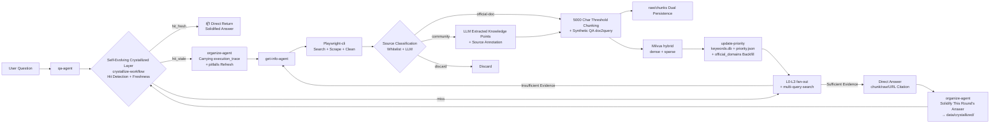
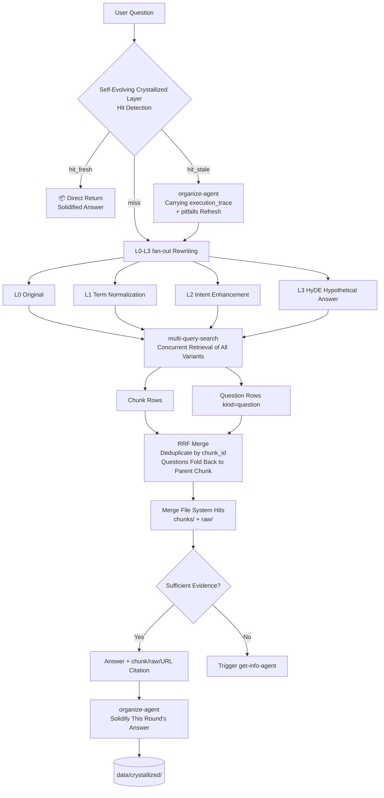
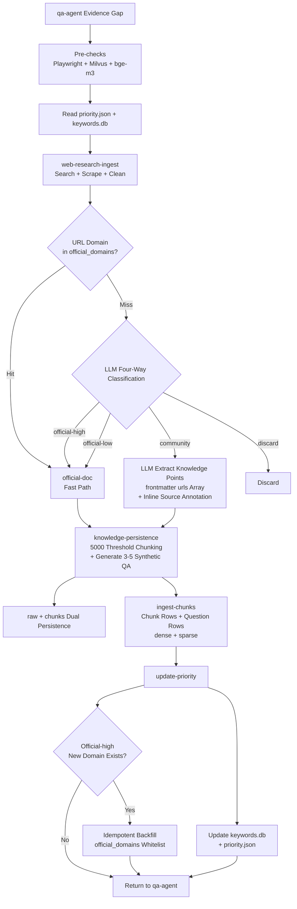

<div align="center">

# brain-base

*Knowledge Base for Claude Code Plugin, enabling RAG capabilities for Claude Code*

[简体中文](./README.md) | **English**

[](https://claude.com/claude-code)
[](LICENSE)
[](https://milvus.io/)
[](https://www.npmjs.com/package/@playwright/cli)

> **Claude-Code-Agent-Plugin** | **QA First** | **Playwright-cli Ingest** | **Milvus RAG** | **MIT License**

</div>

---

## Pain Points

Have you encountered these issues?

| Scenario | Result |
|----------|--------|
| Q&A systems only provide "instant answers" without long-term accumulation | Same questions searched and answered repeatedly, knowledge cannot be reused |
| Only vector databases used, original documents not preserved | Unable to audit sources and context when disputes arise |
| Direct web scraping for every new question | High cost, slow, and easy to pollute the knowledge base |
| Mixed scraping tools with inconsistent calls | Unmaintainable processes, difficult troubleshooting |
| RAG reruns retrieval and synthesis for every query without accumulation | Similar questions require full pipeline rerun, wasting time and tokens |

**brain-base** is not "just another retrieval script", but a sustainable, self-evolving knowledge loop:

1. `qa-agent` first checks the self-evolving crystallized layer for solidified answers; if hit and fresh, returns directly.
2. If not hit, performs local RAG retrieval, then decides whether to supplement the knowledge base.
3. `get-info-agent` only triggers external scraping when evidence is insufficient.
4. External materials must be saved to `raw + chunks + Milvus + keywords.db` simultaneously.
5. `playwright-cli` serves as the unified entry point for external web scraping.
6. After a satisfactory Q&A session, `organize-agent` solidifies the answer into the self-evolving crystallized layer for shortcut returns on similar future questions.

---

## Core Philosophy

This project adheres to three main principles:

1. **Answers must be traceable**: Answers should link back to chunks, raw documents, and source URLs.
2. **Knowledge must be evolvable**: Each knowledge base supplement should be reusable by subsequent retrievals.
3. **Results must be accumulative**: Successfully answered questions should be solidified so similar questions don't require rerunning the RAG pipeline.

This project adopts the [Karpathy LLM Wiki](https://gist.github.com/karpathy/442a6bf555914893e9891c11519de94f) **three-layer architecture**:

| Layer | Responsible for Writing | Function |
|-------|------------------------|----------|
| **Raw Layer** (`data/docs/raw/` + `data/docs/chunks/` + Milvus) | `get-info-agent` | Immutable original evidence, only supplement/repair, no modification |
| **Self-Evolving Crystallized Layer** (`data/crystallized/`) | `organize-agent` | LLM-organized solidified answers, shortcut returns for similar questions |
| **Schema Layer** (`agents/` + `skills/`) | User + Author | Rule files controlling system behavior |



---

## Core Capabilities

- **QA Agent**: First checks self-evolving crystallized layer for solidified answers; if not hit, performs L0-L3 fan-out rewriting (original/normalized/intent-enhanced/HyDE) on user questions and retrieves local knowledge base, then decides whether to supplement.
- **Organize Agent (Self-Evolving Crystallized Layer)**: Benchmarked against Karpathy LLM Wiki pattern. After satisfactory Q&A, solidifies answers, execution paths, and encountered pitfalls as Crystallized Skills; hit and fresh → direct return; hit but stale → carries original `execution_trace` and `pitfalls` to guide get-info-agent for precise refresh.
- **Get-Info Agent**: Dispatcher for external supplementation. Orchestrates **Playwright-cli** scraping, cleaning, chunking, and persistence.
- **Playwright-cli**: Directly uses official `playwright-cli` command following official repository installation and invocation recommendations.
- **Milvus hybrid index (default bge-m3)**: Dense + sparse dual recall, supporting chunk rows + synthetic question rows (doc2query).
- **5000 Character Chunking Threshold**: Short documents (≤ 5000 chars) remain as single chunks; long documents are split at Markdown semantic boundaries.
- **multi-query-search**: Converts multiple query variants into CLI calls, automatically concurrent retrieval, RRF merging, and deduplication by chunk_id.
- **Skill Workflows**: Production-grade workflow constraints for query rewriting, evidence judgment, scraping process, persistence process, and crystallized layer hit/refresh flows.
- **Dynamic Site Priority**: Updates `priority.json` and `keywords.db` based on actual hit results.
- **Non-Official Source Content Extraction**: Blogs, tutorials, Q&A posts are not stored whole; LLM extracts useful knowledge points and reorganizes into documents with `> Source: <url>` traceability annotations. Full traceability preserved in file system (frontmatter `urls` array + inline annotations), searchable via grep without additional database.
- **Official Domain Self-Learning Whitelist**: `priority.json.official_domains` serves as classification fast lane; new domains LLM-high-confidence-classified as official are idempotently backfilled by `update-priority`, becoming more accurate over time.

---

## Workflow Overview

### QA Process

1. Receive user question.
2. **Step 0: Self-Evolving Crystallized Layer Hit Detection** (Crystallized Layer Shortcut):
   - `hit_fresh` → Directly return solidified answer, marking `> 📦 From self-evolving crystallized layer solidified answer...` at the beginning
   - `hit_stale` → Delegate to `organize-agent` carrying `execution_trace` and `pitfalls` to dispatch get-info-agent for refresh, then regenerate answer
   - `miss` / `degraded` → Continue with the following RAG process
3. Perform L0-L3 fan-out rewriting, producing 4-6 query variants:
   - **L0** User original sentence
   - **L1** Term normalization (abbreviation expansion / Chinese-English aliases / standard product names)
   - **L2** Intent enhancement (action words / step words / version words / time words)
   - **L3** HyDE hypothetical answer (fabricate an "ideal answer beginning" to use as query)
4. Prioritize local knowledge retrieval:
   - First check `data/docs/chunks/`
   - Then check `data/docs/raw/`
   - Then call `python bin/milvus-cli.py multi-query-search` to throw all variants into concurrent retrieval + RRF merging + deduplication by `chunk_id` (synthetic question rows automatically fold back to parent chunk)
5. Merge file system hits with multi-query-search results, prioritizing chunks hit by both layers.
6. Judge evidence sufficiency and freshness.
7. Only trigger `get-info-agent` when local evidence is insufficient and external knowledge is clearly needed.
8. Answer user based on evidence.
9. **Step 9: Delegate to `organize-agent` to solidify this round's answer** — when solidification conditions are met, asynchronously write to `data/crystallized/` for shortcut return on similar future questions.



### Get-Info Process

1. Receive question, query variants, and evidence gaps from `qa-agent`.
2. Perform pre-checks (Playwright-cli, Milvus MCP, local bge-m3 model availability).
3. Read `data/priority.json` and `data/keywords.db`.
4. Call `get-info-workflow` to orchestrate sub-processes.
5. Call `playwright-cli-ops` and `web-research-ingest` to execute search, scraping, and preliminary cleaning.
6. **Source Classification and Content Extraction**: Two-level classification by "whitelist + LLM" to determine if document belongs to `official-doc` / `community` / `discard`; `community` sources enter extraction flow, reorganized as new Markdown with `> Source: <url>` annotations per knowledge point; `discard` directly dropped.
7. Call `knowledge-persistence` to save raw Markdown, perform LLM chunking by 5000 character threshold rules.
8. **For each chunk, call LLM to generate 3-5 synthetic QA questions**, written to chunk frontmatter `questions: [...]`.
9. Write to Milvus by chunk (`ingest-chunks` writes both chunk rows and question rows, dense + sparse in hybrid mode).
10. Update `keywords.db` and `priority.json` (`update-priority` idempotently backfills new domains LLM-high-confidence-classified as official to `official_domains` whitelist).



---

## Persistence Design

### Why Keep Both raw and chunks

This project is not just a vector database. The file system is also a first-class storage layer.

1. `raw` preserves complete cleaned Markdown, suitable for auditing, review, and preserving full context.
2. `chunks` preserves grep-able, RAG-ready thematic fragments, suitable for precise retrieval and citation.
3. Milvus is only responsible for storage and retrieval, not for generating embeddings out of thin air.

### Chunking Principles (with 5000 Character Hard Threshold)

Chunking is dominated by Claude Code or Codex models, not complex local chunking systems. Model chunking **must obey** the following hard constraints:

1. **Body ≤ 5000 characters → Entire document becomes 1 chunk, do not split.** This prevents short MDs from being unnecessarily chopped into multiple pieces.
2. **Body > 5000 characters → Split at Markdown semantic boundaries**, each chunk max 5000 characters, target 2000-5000 characters/chunk.
3. Prioritize splitting by H2/H3 heading hierarchy; secondarily by step groups, FAQ Q&A pairs.
4. **Do not hard-split in the middle of code blocks, tables, command examples, or lists.**
5. Individual chunks maintain thematic completeness for Grep and RAG.
6. Light overlap ≤ 200 characters allowed when necessary, but avoid duplicate pollution.
7. Extreme degradation: When a single semantic block itself > 5000 characters with no safe split points (e.g.,超长 code block), character hard-split is allowed with `truncated: true` marker.

### Chunk Goals

A high-quality chunk must simultaneously satisfy:

1. Understandable main theme when taken alone.
2. Preserves heading path, summary, keywords, `questions` synthetic question list for Grep + vectorization dual recall.
3. Can trace back to raw document and original URL.
4. Short enough to avoid mixing multiple unrelated themes; complete enough to not lose context.

### Synthetic QA Index (doc2query)

Before each chunk is persisted, LLM generates 3-5 synthetic questions in user voice, written to frontmatter:

```yaml
questions: ["How to create Claude Code subagent?", "Required frontmatter fields for subagent?", "Relationship between subagent and plugin?"]
```

`bin/milvus-cli.py ingest-chunks` automatically embeds each question independently (row type `kind=question`, `chunk_id` points to parent chunk). During retrieval, these question rows participate in RRF alongside body chunk rows, finally deduplicated by `chunk_id`, **significantly reducing the semantic gap between user colloquial queries and document terminology**.

---

## Milvus and Vectorization Boundaries

These are the boundaries that must be obeyed in the current project:

1. **Milvus is a vector database, not a general embedding generator.**
2. Dense vectors must come from providers capable of returning embeddings.
3. Providers can be local embedding models or online embedding APIs.
4. General LLMs that can only return text, not embeddings, cannot directly replace the vectorization stage.
5. Sparse / BM25 retrieval and dense retrieval should both be formal design components, no longer using pseudo-vector placeholders.
6. **Current default provider is `BAAI/bge-m3`** (hybrid, dense 1024-dim + sparse), first startup requires downloading ~1.4 GB model. CPU runnable but slow vectorization; set `KB_EMBEDDING_DEVICE=cuda` for significant GPU acceleration. For lightweight fallback to 384-dim dense-only, set `KB_EMBEDDING_PROVIDER=sentence-transformer`.

---

## Agent and Skill Layers

### Agents

1. `qa-agent`: Main Q&A Agent. Check crystallized layer → Check RAG → Trigger get-info-agent supplementation when necessary → Answer → Trigger organize-agent solidification.
2. `organize-agent`: **Self-Evolving Crystallized Layer Dispatcher Agent**. Responsible for solidification, refresh, feedback processing, health checks; **does not modify raw layer**, carries original `execution_trace` + `pitfalls` to call get-info-agent during refresh.
3. `get-info-agent`: External supplementation Agent. Orchestrates Playwright-cli scraping, cleaning, chunking, persistence.

### Skills

QA, Get-Info, and Organize agents dispatch the following skills:

1. `qa-workflow`: Crystallized layer hit detection (Step 0), L0-L3 fan-out rewriting, multi-query-search invocation, evidence sufficiency judgment, triggering organize-agent solidification (Step 9).
2. `crystallize-workflow`: Crystallized layer hit detection / freshness judgment / write / refresh; semantics for `data/crystallized/index.json` and `<skill_id>.md` check-in/check-out.
3. `crystallize-lint`: Crystallized layer health checks, periodic cleanup of rejected / garbage entries, detection of orphan files and corrupted files.
4. `playwright-cli-ops`: Stable Playwright-cli invocation.
5. `web-research-ingest`: Search, scrape, clean web content.
6. `knowledge-persistence`: 5000 character threshold chunking, synthetic QA generation, raw/chunks persistence, Milvus hybrid persistence.
7. `get-info-workflow`: Orchestrate execution order and failure policies of above sub-skills.
8. `update-priority`: Update keyword and priority status.
9. `brain-base-skill`: **External Agent Invocation Manual** — deployed in `~/.claude/skills` or `~/.codex/skills`, teaches other Agents how to invoke the knowledge base qa-agent via `claude -p ... --plugin-dir ... --agent brain-base:qa-agent --dangerously-skip-permissions`.

---

## External Agent Invocation of brain-base

brain-base can not only be used as a Plugin in Claude Code, but any system with Claude Code installed can invoke it via command line.

### Invocation Comparison

| Scenario | Configuration | Command |
|----------|-------------|---------|
| **Plugin Mode** | brain-base installed in `~/.claude/plugins/` | `claude --agent brain-base:qa-agent --dangerously-skip-permissions` |
| **Project-level Mode** | brain-base stored as regular project | `claude -p "question" --plugin-dir <PATH> --agent brain-base:qa-agent --dangerously-skip-permissions` |

### Project-level Invocation Steps

When brain-base is used as a project-level project, other projects wanting to invoke it:

**1. Deploy brain-base-skill**

Copy `skills/brain-base-skill/` to the invoker machine's `~/.claude/skills/` or `~/.codex/skills/`:

```bash
cp -r skills/brain-base-skill ~/.claude/skills/
```

**2. Determine brain-base Path**

The invoker needs to know brain-base's absolute path. Three options:

- **Environment Variable (Recommended)**: Set in `.env`: `BRAIN_BASE_PATH=/absolute/path/to/brain-base`
- **Relative Path**: If invoker and brain-base have fixed directory relationship (e.g., `~/projects/brain-base` and `~/projects/caller-project`)
- **Claude Code Lookup**: Ask Claude Code "where is the brain-base project"

**3. Invocation Example**

```bash
export BRAIN_BASE_PATH="/home/user/projects/brain-base"

claude -p "How to configure Claude Code subagent?" \
  --plugin-dir "$BRAIN_BASE_PATH" \
  --agent brain-base:qa-agent \
  --dangerously-skip-permissions
```

### Why `--dangerously-skip-permissions` is Required

qa-agent execution triggers `get-info-agent` for web scraping, file writing, etc. Without this parameter, Claude Code would pop up permission confirmation dialogs at every step, causing:

- Process hangs when called as subprocess with no one to respond
- Automated flows frequently interrupted

Therefore must skip permission confirmation when invoking from external Agent.

### Solidification Feedback

After Q&A completion, feedback needs to be sent to confirm solidification:

```bash
claude -p -c "User did not reject, confirm solidify previous round's answer" \
  --plugin-dir "$BRAIN_BASE_PATH" \
  --agent brain-base:qa-agent \
  --dangerously-skip-permissions
```

More details see `skills/brain-base-skill/SKILL.md`.

---

## Quick Start

The following commands default to execution in the `brain-base` repository root directory. If you're not currently in that directory, please enter it first; the `.` in `--plugin-dir .` refers to the current directory.

If you want the "long-term runnable, full-permission automation, background supplementation strategy" usage, see the complete manual:

- [OPERATIONS_MANUAL.md](./OPERATIONS_MANUAL.md) | [OPERATIONS_MANUAL_en.md](./OPERATIONS_MANUAL_en.md)

### 1. Start Milvus

```bash
docker compose up -d
```

Verify Milvus:

```bash
curl http://localhost:9091/healthz
```

### 2. Install Python Dependencies

The following commands install to your currently selected Python environment. If using a virtual environment, please activate it first before installation.

```bash
python -m pip install -U "pymilvus[model]" sentence-transformers FlagEmbedding
```

Notes:

1. `pymilvus[model]` provides vectorization helper functions (including BGE-M3 / SentenceTransformer / OpenAI three wrappers).
2. `sentence-transformers` is the underlying dependency for BGE-M3 and sentence-transformer models.
3. `FlagEmbedding` is the official inference library for BAAI/bge-m3; first call automatically downloads ~1.4 GB model to `~/.cache/huggingface/`.

### 3. Prepare Official Milvus MCP Server

1. Install `uv` (officially recommended runtime).
2. Clone official repository to this project's conventional path:

```bash
git clone https://github.com/zilliztech/mcp-server-milvus.git ./mcp/mcp-server-milvus
```

3. Project root already provides `.mcp.json`, will start Milvus MCP via stdio method recommended by official README.
4. Confirm local vectorization capability available via pre-check command:

```bash
python bin/milvus-cli.py check-runtime --require-local-model --smoke-test
```

### 4. Confirm Playwright-cli Availability (Required for Agent Integration Scenarios)

`get-info-agent`'s external scraping pipeline depends on official **Playwright-cli**. Invocation constraint: prioritize `playwright-cli`, secondarily `npx --no-install playwright-cli`, do not silently substitute other scrapers.

1. Install official CLI:

```bash
npm install -g @playwright/cli@latest
```

This command installs `playwright-cli` to global Node environment.

2. For Agent integration with Claude Code, Codex, Cursor, Copilot, etc., install CLI skills per official README (this project treats as required step):

```bash
playwright-cli install --skills
```

3. Verification command:

```bash
playwright-cli --help
```

4. If you already have `@playwright/cli` locally installed in current project, you can also use:

```bash
npx --no-install playwright-cli --help
```

### 5. Start QA Agent

```bash
claude --plugin-dir . --agent brain-base:qa-agent
```

Here `.` represents current directory, so this command requires you to be in the `brain-base` repository root directory. If you're currently in its parent directory, use instead:

```bash
claude --plugin-dir ./brain-base --agent brain-base:qa-agent
```

#### For fully hands-off operation

```bash
claude --plugin-dir . --agent brain-base:qa-agent --dangerously-skip-permissions
```

### 6. If you have installed and enabled this plugin, you can also configure default agent in `.claude/settings.json`

```json
{
  "$schema": "https://json.schemastore.org/claude-code-settings.json",
  "agent": "brain-base:qa-agent"
}
```

Configuring `agent` alone does not substitute `--plugin-dir .`. If you're directly temporarily loading the plugin from current repository directory, you still need to use the above command to start.

### 7. Start Asking Questions

Local knowledge Q&A:

```text
Please tell me how to create Claude Code subagent?
```

Force external knowledge supplementation:

```text
Please first supplement latest Claude Code documents from the web, then answer how to create subagent.
```

---

## Data and Configuration

### `data/priority.json`

This file maintains site priorities, keywords, and last update time.

```json
{
  "version": "1.1.0",
  "update_interval_hours": 24,
  "last_update": "2026-04-12T00:00:00Z",
  "official_domains": [
    "docs.anthropic.com",
    "github.com/anthropics"
  ],
  "sites": {
    "anthropic": {
      "priority": 10,
      "keywords": ["claude-code", "subagent", "plugin"]
    }
  }
}
```

Field descriptions:

1. **`official_domains`**: Official domain whitelist (can be empty array). `get-info-workflow` queries whitelist first when classifying non-official/official sources, if miss then LLM comprehensive judgment; new domains LLM-high-confidence-classified as official are idempotently backfilled here by `update-priority`. Only serves as classification acceleration channel, not security boundary, users can manually edit anytime.
2. **`sites.<site_id>.priority`**: Site priority score, higher values indicate retrieval priority.
3. **`sites.<site_id>.keywords`**: Site-associated keywords for keyword reinforcement.

### `data/keywords.db`

Records keywords, sites, query counts, last query times. It does not replace `priority.json`, but provides factual basis for priority updates.

Table structure:

1. **`keywords`**: Keyword popularity records (site_id, keyword, query_count, last_query_at).

Extracted source URLs are not separately stored in tables: they are written directly as document metadata in the chunk frontmatter `urls` field and inline `> Source: <url>` annotations, traceable via grep or file reading.

### Directory Structure

```text
brain-base/
├── .mcp.json
├── agents/
│   ├── qa-agent.md
│   ├── get-info-agent.md
│   └── organize-agent.md         # Self-Evolving Crystallized Layer Dispatcher Agent
├── skills/
│   ├── qa-workflow/
│   ├── crystallize-workflow/     # Crystallized Layer Hit Detection / Write / Refresh
│   ├── crystallize-lint/         # Crystallized Layer Health Checks
│   ├── get-info-workflow/
│   ├── playwright-cli-ops/
│   ├── web-research-ingest/
│   ├── knowledge-persistence/
│   ├── update-priority/
│   └── brain-base-skill/         # External Agent Invocation Manual
├── bin/
│   ├── milvus-cli.py
│   └── scheduler-cli.py
├── planning/                     # Project convergence and transformation plans
├── data/                         # gitignored, auto-created at runtime
│   ├── docs/
│   │   ├── raw/                  # Raw Layer — LLM read-only
│   │   └── chunks/               # Chunk Layer — written by get-info-agent
│   ├── crystallized/             # Self-Evolving Crystallized Layer — written by organize-agent
│   │   ├── index.json            # Solidified skill index
│   │   └── <skill_id>.md         # Each solidified skill one file
│   ├── priority.json
│   └── keywords.db
└── mcp/
    └── milvus-rag/
```

---

## CLI Tools

```bash
# View current Milvus/provider configuration
python bin/milvus-cli.py inspect-config

# Check local vectorization model and vectorization capability
python bin/milvus-cli.py check-runtime --require-local-model --smoke-test

# Ingest chunk Markdown to Milvus (default append; hybrid mode auto-writes dense + sparse;
# also writes questions list from frontmatter as independent rows, kind=question)
python bin/milvus-cli.py ingest-chunks --chunk-pattern "data/docs/chunks/*.md"

# Overwrite/replace a document (delete then write, use with caution)
python bin/milvus-cli.py ingest-chunks --chunk-pattern "data/docs/chunks/claude-code-agent-teams-2026-04-12-*.md" --replace-docs

# Dense retrieval (single query, legacy call)
python bin/milvus-cli.py dense-search "search keyword"

# Hybrid retrieval (single query, bge-m3 dense+sparse)
python bin/milvus-cli.py hybrid-search "search keyword"

# Multi-query fan-out retrieval (recommended main path)
# Each --query corresponds to one L0/L1/L2/L3 rewrite; CLI auto-concurrent retrieval + RRF merge + dedup by chunk_id
python bin/milvus-cli.py multi-query-search \
  --query "claude code subagent configuration" \
  --query "Claude Code subagent configuration" \
  --query "how to create Claude Code subagent" \
  --query "Claude Code subagent defined through YAML files under .claude/agents..." \
  --top-k-per-query 20 --final-k 10

# Check if priority update time window reached
python bin/scheduler-cli.py --check

# Update keyword
python bin/scheduler-cli.py --keyword "claude-code" --site anthropic
```

### Provider Switching and Collection Rebuild

Switching `KB_EMBEDDING_PROVIDER` (e.g., bge-m3 ↔ sentence-transformer) changes dense dimension and schema:

1. CLI fails fast on dim mismatch or schema mismatch, will not silently write dirty data.
2. Must drop old collection before re-ingesting; simplest approach is delete collection in Milvus then run `ingest-chunks`, CLI will rebuild schema per current provider.
3. Default provider is already `bge-m3` (hybrid, dense 1024-dim + sparse). For fallback to sentence-transformer, set `KB_EMBEDDING_PROVIDER=sentence-transformer`, dense becomes 384-dim, sparse field empty (dense-only retrieval).

---

## Data Storage Warning

> This Plugin will continuously write knowledge to the `data/` directory. As usage time grows, data volume will keep increasing.
>
> Strongly recommend installing the Plugin in a **project-level directory**, not directly piling up in user-level global configuration directory for long-term use.

---

## Milvus MCP

This project connects to official `zilliztech/mcp-server-milvus` via plugin root directory `.mcp.json`.

Connection follows MCP conventions in Anthropic plugin documentation: place `.mcp.json` in plugin root, connected by Claude when loading plugin.

Current `.mcp.json` uses the `uv --directory ... run server.py` stdio method recommended by official README.

Example:

```json
{
  "mcpServers": {
    "milvus": {
      "type": "stdio",
      "command": "uv",
      "args": [
        "--directory",
        "./mcp/mcp-server-milvus/src/mcp_server_milvus",
        "run",
        "server.py",
        "--milvus-uri",
        "http://127.0.0.1:19530"
      ]
    }
  }
}
```

`mcp/milvus-rag/` remains as in-project adapter layer for compatibility and migration, no longer serving as official MCP replacement.

---

## Current Implementation Status

This repository currently completed:

1. All `skills` and `agents` elevated to production-grade workflow definitions.
2. Clear collaboration boundaries for QA, Get-Info, and Organize three types of Agents.
3. raw/chunks dual-replica persistence + 5000 character threshold chunking rules.
4. Default BGE-M3 hybrid ingestion pipeline (dense + sparse), `ingest-chunks` end-to-end available.
5. Synthetic QA (doc2query) index layer: 3-5 questions per chunk independently vectorized.
6. multi-query-search CLI: L0-L3 fan-out + RRF merge + dedup by chunk_id.
7. Non-official source content extraction and traceability annotation: whitelist fast lane + LLM four-way classification + `update-priority` self-learning backfill `official_domains`, full traceability in extracted docs `urls` frontmatter field and inline `> Source: <url>` annotations.
8. **Self-Evolving Crystallized Layer (Crystallized Skill Layer)**: Benchmarked against Karpathy LLM Wiki pattern, `organize-agent` + `crystallize-workflow` + `crystallize-lint` maintain solidified answers under `data/crystallized/`; hit and fresh direct return, hit but stale auto-carry original `execution_trace`/`pitfalls` dispatch get-info-agent for precise refresh. Does not intrude raw layer, automatic degradation to RAG main chain when crystallized layer corrupted.

If you continue extending this project, recommended priorities:

1. Chunk quality regression tests and deduplication strategy (automated validation of 5000 character threshold and questions field completeness).
2. Evaluation set (gold queries → expected chunk_ids), run multi-query-search to quantify recall rate.
3. Synthetic QA offline generation script (currently generated by agent before write; can add `synthesize-questions` CLI for historical chunk backfill).
4. Crystallized layer hit detection upgrade from "LLM semantic discrimination" to "embedding similarity + LLM dual validation" two-level filtering (when crystallized skill count exceeds 200).
5. Batch crystallized answers into Milvus, let RAG retrieval also hit existing Crystallized Skills — LLM Wiki v2 "crystallization from exploration" approach.

