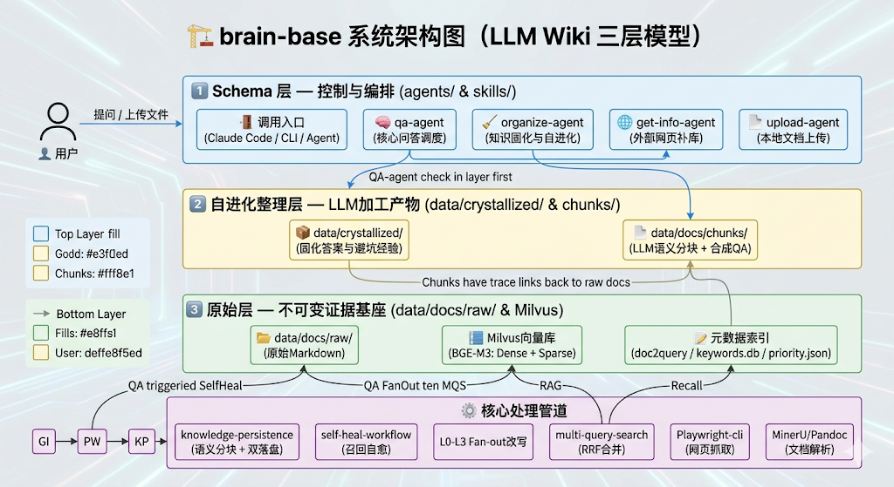
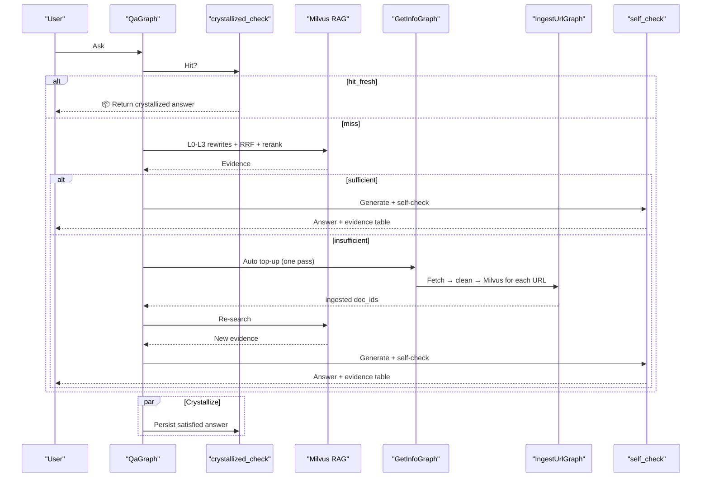

<div align="center">

# brain-base

*LangGraph-driven personal knowledge base: auto retrieval / external top-up / crystallized reuse, built on a three-layer RAG architecture.*

[简体中文](./README.md) | [English](./README_en.md)

[](https://langchain-ai.github.io/langgraph/)
[](https://milvus.io/)
[](https://huggingface.co/BAAI/bge-m3)
[](LICENSE)

> **LangGraph StateGraph** | **Docker One-Click** | **Multi-Provider LLM** | **Self-Evolving Crystallized Layer**

</div>

<div align="center">

</div>

---

## Pain points

| Scenario | Outcome |
|------|------|
| Q&A systems only "answer in the moment", never deposit knowledge | The same questions are asked and answered repeatedly; nothing accumulates |
| Vector-store-only setup with no raw document | When disputes arise you cannot audit the source or context |
| Scraping the web on every new question | Expensive, slow, and pollutes the knowledge base |
| Full RAG pipeline reruns every time | Similar questions rerun the whole chain, wasting time and tokens |
| Local papers / PDFs / Word / LaTeX cannot be indexed | The KB can only grow via scraping; your own files never get in |
| A 16 GB GPU OOMs running MinerU-HTML | After container isolation + flash kernel + head+tail truncation the peak is just 1.1 GB |

**brain-base** is not "yet another retrieval script" — it is a **self-evolving knowledge loop built on LangGraph StateGraphs**:

1. `QaGraph` first probes the crystallized layer; a fresh hit returns immediately.
2. Miss → local Milvus RAG (BGE-M3 hybrid dense+sparse + cross-encoder rerank).
3. Insufficient evidence → `GetInfoGraph` auto top-up → `IngestUrlGraph` fetches / cleans / ingests → re-search.
4. Local files flow through `IngestFileGraph` (MinerU + pandoc → Markdown).
5. After answer generation a Maker-Checker self-check validates faithfulness / completeness / consistency.
6. Satisfied answers are crystallized by `CrystallizeGraph` into `data/crystallized/` so similar questions short-circuit next time.

---

## 5-minute quickstart

Four steps for the first run. **If you only care about how to use it, this section is enough**; if you want to know how the 8 graphs cooperate and why it is designed this way, keep reading the architecture sections below.

### 1. Start dependencies

```bash
docker compose up -d   # Brings up Milvus trio + brain-base-worker (Python+Node+Playwright+MinerU+bge-m3 cache)
```

### 2. Configure an LLM provider

Copy `.env.example` to `.env` and fill in any one provider's key:

```ini
BB_LLM_PROVIDER=anthropic
BB_LLM_BASE_URL=https://api.minimaxi.com/anthropic
BB_DEEP_THINK_LLM=MiniMax-M2.7
BB_LLM_API_KEY=sk-xxx
```

### 3. Health check

```bash
docker compose exec brain-base-worker python -m brain_base.cli health
```

You should see Milvus / playwright / LLM all green.

### 4. First question + first ingest

```bash
# A. Empty KB → asking triggers auto top-up (Bing search → fetch → ingest → answer)
python -m brain_base.cli ask "What is LiteLLM and how do I use it?"

# B. Proactively ingest an official doc → similar questions return instantly next time
python -m brain_base.cli ingest-url --url "https://docs.litellm.ai/" --source-type official-doc --topic "LiteLLM"

# C. Ingest local papers / DOCX / MD (auto-converted via MinerU)
python -m brain_base.cli ingest-file --path ./papers/paper.pdf
```

> **90% of daily use is just `ask` and `ingest-*`**: `ask` automatically chains retrieval / top-up / self-check / crystallization — you don't have to memorize 8 subgraphs.
>
> Want more commands → jump to [CLI usage](#cli-usage); want an external agent to call brain-base → read `brain-base-skill/SKILL.md`.

---

## Core philosophy

1. **Answers must be traceable** — every answer can be traced back to chunk / raw / source URL.
2. **Knowledge must evolve** — every top-up becomes reusable for later retrieval.
3. **Results must accumulate** — successful answers are crystallized so similar questions skip the RAG chain.

**Three-layer architecture**:

| Layer | Storage | Writers | Role |
|---|---|---|---|
| **Raw layer** | `data/docs/raw/` + Milvus (chunks) | `IngestUrlGraph` (web top-up) / `IngestFileGraph` (local files) | Immutable evidence; two parallel write paths; append/repair only, never mutated |
| **Self-evolving layer** | `data/docs/chunks/` + `data/crystallized/` | `PersistenceGraph` (chunker + enrichment) / `CrystallizeGraph` (crystallization) | chunker-generated chunks + crystallized answers; similar questions short-circuit |
| **Control layer** | `brain_base/graphs/` + `brain_base/prompts/` | Maintainers | 8 LangGraph StateGraphs that govern system behavior |

---

## LangGraph overview

All business logic lives in **8 LangGraph subgraphs**, orchestrated at the top level by `brain_base/graph/brain_base_graph.py:BrainBaseGraph`:

| Graph | File | Role | Key nodes |
|---|---|---|---|
| **QaGraph** | `graphs/qa_graph.py` | User Q&A (with auto top-up loop) | probe → crystallized_check → normalize → decompose → rewrite → search → judge → (insufficient) get_info_trigger → web_research → select_candidates → ingest_candidates → re_search → judge → answer → self_check → crystallize_answer |
| **GetInfoGraph** | `graphs/get_info_graph.py` | External top-up orchestration | plan → search → classify → loop until target |
| **IngestUrlGraph** | `graphs/ingest_url_graph.py` | URL fetch + ingest | fetch → clean → completeness → frontmatter → persist |
| **IngestFileGraph** | `graphs/ingest_file_graph.py` | Local file ingest (MinerU + pandoc) | convert → persist |
| **PersistenceGraph** | `graphs/persistence_graph.py` | chunker + enrichment + Milvus write | chunker → enrich → ingest |
| **CrystallizeGraph** | `graphs/crystallize_graph.py` | Crystallize answers into the self-evolving layer | value_score → write |
| **LifecycleGraph** | `graphs/lifecycle_graph.py` | Cross-store consistent deletion (Milvus + raw + chunks + index) | dryrun → delete |
| **LintGraph** | `graphs/lint_graph.py` | Crystallized layer health check | scan → cleanup |

**QA auto top-up loop** (T10 done):



---

## Capabilities

- **8 LangGraph subgraphs** with single responsibilities; state fields are explicitly declared (`TypedDict(total=False)` drops fields silently, so **never** rely on undeclared keys).
- **Multi-provider LLM**: switch via `BB_LLM_PROVIDER` across anthropic / openai / deepseek / qwen / glm / minimax / xai / openrouter — everything goes through LangChain `BaseChatModel`.
- **Milvus hybrid retrieval**: default `BAAI/bge-m3` (dense 1024 + sparse) with `bge-reranker-v2-m3` cross-encoder rerank (soft dependency, silently falls back when unavailable).
- **Auto top-up loop**: insufficient local evidence → `GetInfoGraph` scrapes → `IngestUrlGraph` serial ingestion (tiered quota: official ≤5 / community ≤3 / total ≤6) → re-search; infinite-loop guard forces answer on second round.
- **Docker one-click + mineru-html container isolation**: Milvus trio + brain-base-worker (Python/Node/Playwright-cli/MinerU) containerized. A custom `LeanTransformersBackend` (monkey-patches `caching_allocator_warmup` and skips HF pipeline re-dispatch) drops MinerU-HTML peak GPU from 16 GB OOM to **1.10 GB**, with head+tail prompt truncation that preserves the terminal instructions.
- **SPA / Docusaurus extraction**: before feeding HTML to the SLM, `<script>/<style>/<noscript>/<iframe>/<svg>` and `<link rel=prefetch|preload|...>` are stripped to prevent dozens of prefetch links from consuming the 16 K context window.
- **Local file ingest**: `IngestFileGraph` via `bin/doc-converter.py` handles PDF / DOCX / PPTX / XLSX / LaTeX / TXT / MD / images (MinerU 3.x + pandoc).
- **Self-evolving crystallized layer**: `CrystallizeGraph` scores answers on four dimensions and writes to hot/cold tiers; fresh hits short-circuit, stale hits trigger refresh via top-up.
- **Cross-store consistent deletion**: `LifecycleGraph` prints a dry-run manifest first; only `--confirm` actually deletes across Milvus / raw / chunks / doc2query-index / crystallized.
- **Session persistence**: `ask` / `resume` / `feedback` events are appended to `data/conversations/<session_id>.jsonl`; multi-turn dialogues reuse the session_id.
- **doc2query synthetic QA index**: each chunk gets 3-5 LLM-generated user-style questions, independently embedded (`kind=question`), narrowing the gap between colloquial queries and document terminology.
- **Maker-Checker self-check**: after generation the LLM rates faithfulness / completeness / consistency; only deletions (no additions) are allowed during a single repair pass.
- **Content-hash deduplication**: SHA-256 of raw body checked before ingest; `find-duplicates` / `backfill-hashes` for periodic maintenance.

---

## Quick start

### Option A: Docker one-click (recommended)

Brings up the Milvus trio + brain-base-worker (Python + Node.js + Claude Code CLI + Playwright-cli + MinerU + BGE-M3 cache) in one command:

```bash
docker compose up -d
```

Verify:

```bash
curl http://localhost:9091/healthz                              # Milvus
docker compose exec brain-base-worker python -m brain_base.cli health
```

The host `~/.cache/huggingface` is mounted into the container so BGE-M3 (~1.4 GB) and MinerU (~2 GB) are downloaded only once.

### Option B: local Python + Dockerized Milvus

```bash
docker compose up -d etcd minio standalone         # Milvus only
python -m pip install -r requirements.txt
python -m brain_base.cli health
```

### Configure an LLM provider

Copy `.env.example` to `.env` and fill any one provider's key:

```bash
# Anthropic / Claude
BB_LLM_PROVIDER=anthropic
BB_DEEP_THINK_LLM=claude-sonnet-4-20250514
BB_LLM_API_KEY=sk-ant-xxx

# Or MiniMax (Anthropic-compatible endpoint)
BB_LLM_PROVIDER=anthropic
BB_LLM_BASE_URL=https://api.minimaxi.com/anthropic
BB_DEEP_THINK_LLM=MiniMax-M2.7
BB_LLM_API_KEY=sk-xxx

# Or OpenAI-compatible (DeepSeek / Qwen / GLM / etc.)
BB_LLM_PROVIDER=openai
BB_LLM_BASE_URL=https://api.deepseek.com/v1
BB_DEEP_THINK_LLM=deepseek-chat
BB_LLM_API_KEY=sk-xxx
```

Without a key the CLI falls back to heuristic rules (non-blocking).

---

## CLI usage

The main CLI is `python -m brain_base.cli`; every command emits JSON:

```bash
# Infrastructure health (Milvus / playwright / LLM)
python -m brain_base.cli health

# Pure retrieval (no LLM, fastest)
python -m brain_base.cli search --query "bge-m3 usage" --query "BGE-M3 embedding" --rerank

# Full Q&A (LLM-driven, with auto top-up + self-check)
python -m brain_base.cli ask "What's the difference between brain-base search and ask?"

# URL ingest (IngestUrlGraph)
python -m brain_base.cli ingest-url --url "https://docs.litellm.ai/" --source-type official-doc --topic "LiteLLM"

# Local file ingest (IngestFileGraph: PDF / DOCX / PPTX / XLSX / MD / TXT / images)
python -m brain_base.cli ingest-file --path ./papers/paper.pdf --path ./notes.md

# Delete a document (dry-run by default; --confirm to actually delete across Milvus / raw / chunks)
python -m brain_base.cli remove-doc --doc-id my-doc-2026-05-06
python -m brain_base.cli remove-doc --doc-id my-doc-2026-05-06 --confirm

# Crystallized layer hit check
python -m brain_base.cli crystallize-check --question "What is LiteLLM?"

# Crystallized layer health check (clear rejected / orphan files)
python -m brain_base.cli lint
```

### Low-level tools (`bin/*.py`)

| Tool | Role |
|---|---|
| `bin/milvus-cli.py` | All Milvus operations: `inspect-config` / `check-runtime` / `ingest-chunks` / `multi-query-search` / `list-docs` / `drop-collection` / `delete-by-doc-ids` / `hash-lookup` / `find-duplicates` |
| `bin/doc-converter.py` | MinerU + pandoc document-to-Markdown; the `mineru-html` subcommand routes into the Docker container to bypass host GPU OOM |
| `bin/chunker.py` | Deterministic chunker (Markdown semantic boundaries + ≤5000-char short-doc = single chunk) |
| `bin/crystallize-cli.py` | Manual crystallized layer ops (list hot/cold / promote / feedback) |
| `bin/eval-recall.py` | Recall evaluation: `build-queries` / `run` / `diff` / `record-feedback` / `coverage-check` |
| `bin/source-priority.py` | Tag `source_priority` and detect source conflicts |

Common ones:

```bash
python bin/milvus-cli.py inspect-config
python bin/milvus-cli.py check-runtime --require-local-model --smoke-test
python bin/milvus-cli.py multi-query-search --query "..." --rerank --final-k 10
python bin/milvus-cli.py list-docs
```

---

## Configuration

### Key environment variables

| Variable | Default | Purpose |
|---|---|---|
| `KB_MILVUS_URI` | `http://localhost:19530` | Milvus connection |
| `KB_MILVUS_COLLECTION` | `knowledge_base` | collection name |
| `KB_EMBEDDING_PROVIDER` | `bge-m3` | embedding: `bge-m3` (hybrid) / `sentence-transformer` (dense-only 384) / `openai` |
| `KB_EMBEDDING_DEVICE` | `auto` | `auto` / `cuda` / `cpu` |
| `BB_LLM_PROVIDER` | `anthropic` | LLM: `anthropic` / `openai` / `deepseek` / `qwen` / `glm` / `minimax` / `xai` / `openrouter` |
| `BB_LLM_BASE_URL` | empty | compatible endpoint URL |
| `BB_LLM_API_KEY` | empty | API key; when empty, falls back to `ANTHROPIC_API_KEY` / `OPENAI_API_KEY` |
| `BB_DEEP_THINK_LLM` | `claude-sonnet-4-20250514` | model name |

### `data/priority.json`

Holds site priorities, keywords, and the official-domain allowlist. `official_domains` is a classification fast-path (not a security boundary); new domains the LLM classifies as official with high confidence are idempotently back-filled by update-priority.

### Directory layout

```text
brain-base/
├── brain_base/                # LangGraph main package
│   ├── cli.py                  # Main CLI (health / search / ask / ingest-* / remove-doc / lint)
│   ├── config.py               # GetInfoConfig dataclass (all thresholds injectable)
│   ├── graphs/                 # 8 StateGraph subgraphs
│   ├── graph/                  # Top-level orchestration + conditional logic + propagation
│   ├── nodes/                  # Node functions (pure business logic)
│   ├── agents/                 # Pydantic schemas + utils
│   ├── prompts/                # All SYSTEM_PROMPTs centralized
│   ├── llm_clients/            # Multi-provider LLM factory
│   └── tools/                  # milvus_client / doc_converter_tool / web_fetcher
├── bin/                        # Standalone CLI tools (Python scripts)
├── brain-base-skill/           # External Claude Code Agent call-site skill (SKILL.md)
├── tests/                      # pytest (smoke + unit + integration)
├── docker-compose.yml          # Milvus + brain-base-worker
├── Dockerfile                  # brain-base-worker image (Python+Node+Claude+Playwright+MinerU)
├── requirements.txt
├── framework.png
├── CLAUDE.md / AGENTS.md       # Project hard constraints (50 rules)
├── ToDo.md                     # Task tracking (pending / executing / finished)
└── data/                       # .gitignored; created at runtime
    ├── docs/raw/               # Raw layer (IngestUrlGraph / IngestFileGraph)
    ├── docs/chunks/            # Self-evolving layer (PersistenceGraph)
    ├── crystallized/           # Crystallized answers (CrystallizeGraph)
    ├── conversations/          # <session_id>.jsonl event streams
    ├── eval/                   # doc2query-index / coverage / feedback / queries
    ├── priority.json
    ├── keywords.db
    └── lifecycle-audit.jsonl
```

---

## Current status

Completed (2026-05):

1. **LangGraph refactor done** — 8 subgraphs + top-level `BrainBaseGraph`, replacing the old claude-code plugin + skills layout.
2. **QA auto top-up loop** (T10 finished) — insufficient evidence → `GetInfoGraph` → `IngestUrlGraph` serial ingest → `re_search` → `answer`; second-round guard forces an answer; e2e verified.
3. **mineru-html container isolation** (T11 finished) — fixes 16 GB host GPU OOM; peak **1.10 GB**, 32.5 s to extract 6432 chars of markdown.
4. **Multi-provider LLM adaptation** — anthropic / openai / deepseek / qwen / glm / minimax / xai / openrouter via a unified LangChain `BaseChatModel`.
5. **Milvus BGE-M3 hybrid** — dense 1024 + sparse; `multi-query-search --rerank` uses bge-reranker-v2-m3 cross-encoder by default.
6. **Complex-question decomposition** — multi-part / comparison / causal-chain / decision-among-options get split into 2-4 independent subquestions and the evidence is merged; simple factual questions are not decomposed.
7. **Maker-Checker self-check** — faithfulness / completeness / consistency; delete-only (no additions), at most one repair pass.
8. **Self-evolving crystallized layer** — hot/cold tiers + four-dimension value scoring + promotion rules.
9. **Cross-store deletion** — `LifecycleGraph` dry-run + `--confirm` ensures Milvus / raw / chunks / doc2query-index / crystallized stay consistent.
10. **Docker one-click** — Milvus trio + brain-base-worker containerized; model cache persisted.
11. **Session persistence + multi-turn** — `data/conversations/<session_id>.jsonl` append-only event stream.
12. **Content-hash dedup** — `hash-lookup` / `find-duplicates` / `backfill-hashes`.
13. **Recall evaluation baseline** — `eval-recall.py` runs Recall@K + 6-dimension question coverage.
14. **50 hard project constraints** — all recorded in `CLAUDE.md` / `AGENTS.md`; T11 lessons captured as rules 46-50 (LangGraph state must be explicit / SLM head+tail prompt truncation / HTML prefetch stripping / Dockerfile must carry ctypes system libs / transformers backend on Windows needs WDDM-aware OOM defense).

### Roadmap

- Batch upload progress + resumable upload
- Crystallized feedback auto-loop (less manual feedback)
- Full data export (cross-machine migration)
- Crystallized-layer embedding index (once skills exceed ~200)
- Multi-round external top-up (trigger again after attempted, with recursion guard)

---

## Docs

- [CLAUDE.md](./CLAUDE.md) / [AGENTS.md](./AGENTS.md) — project hard constraints (50 rules); every change must comply.
- [ToDo.md](./ToDo.md) — task tracker (pending / executing / finished).
- [md/](./md/) — architecture / operations / migration notes.
- [md/archive/](./md/archive/) — legacy architecture archive (the previous claude-code-plugin-style README is preserved here).

---

## License

MIT.
