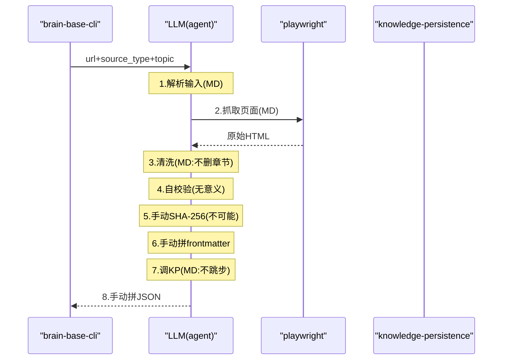
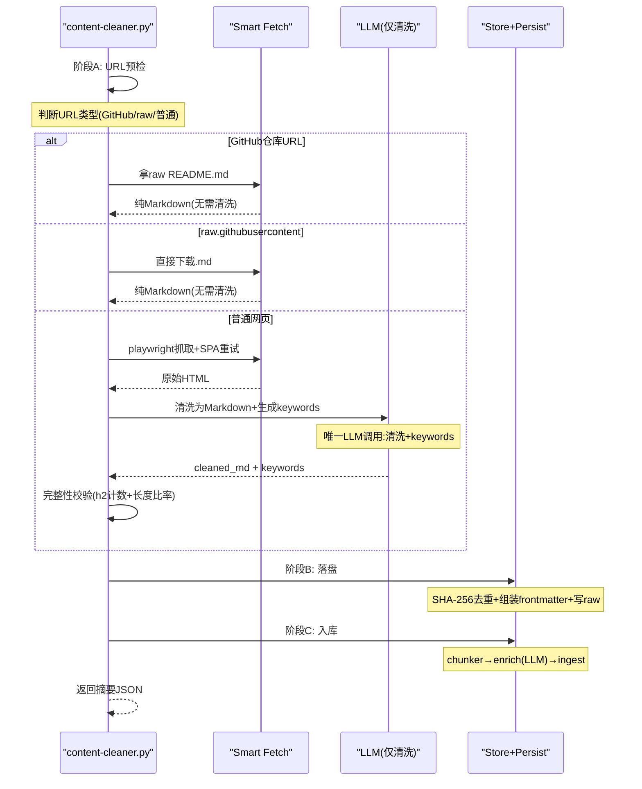

# Content Cleaner Workflow — 新流程设计

## 旧流程（8步串行，全靠MD约束）

## 新流程（3阶段，代码编排，LLM只做清洗+keywords）

## 关键设计决策

### 1. Smart Fetch：URL类型决定抓取策略

| URL模式 | 策略 | 是否需要LLM清洗 |
|---------|------|----------------|
| `github.com/<owner>/<repo>` | 拼接 raw URL 拿 README.md | ❌ |
| `raw.githubusercontent.com/**/*.md` | 直接下载 | ❌ |
| `docs.xxx.com/**/*.md` | 尝试拿 .md 源文件，失败回退 playwright | ❌→✅ |
| 普通网页 | playwright 抓取 HTML | ✅ |

### 2. 合并步骤

| 旧步骤 | 新归属 | 说明 |
|--------|--------|------|
| 步骤1 解析输入 | argparse | 代码 |
| 步骤2 抓取页面 | Smart Fetch | 代码+subprocess |
| 步骤3 清洗为MD | LLM调用 | 唯一需要LLM的步骤 |
| 步骤4 完整性校验 | 校验函数 | 代码，紧跟清洗后 |
| 步骤5 SHA-256+去重 | Store阶段 | 代码，就是一行hashlib |
| 步骤6 frontmatter+写raw | Store阶段 | 代码，字符串模板 |
| 步骤7 knowledge-persistence | Persist阶段 | 代码编排subprocess链 |
| 步骤8 返回摘要 | 函数返回值 | 代码 |

### 3. LLM调用点（仅2处）

1. **清洗+keywords**：输入原始HTML，输出cleaned_md + keywords JSON
2. **chunk enrichment**：输入chunk正文，输出title/summary/keywords/questions（已有enrich-chunks命令）

### 4. GitHub README特殊处理

GitHub仓库首页(`github.com/owner/repo`)的默认展示就是README.md，
但HTML渲染版包含大量GitHub UI元素（导航/侧边栏/Star按钮等）。

正确做法：
- 检测到 `github.com/<owner>/<repo>` 模式
- 自动拼接 `https://raw.githubusercontent.com/<owner>/<repo>/main/README.md`
- 如果 main 分支不存在，试 `master` 分支
- 拿到纯 Markdown，**跳过清洗步骤**，直接进入 Store 阶段
- frontmatter 的 `source_type` 仍按原分类（official-doc/community）

### 5. 文件位置

`skills/content-cleaner-workflow/content-cleaner.py`
- 作为该 skill 的专属脚本
- 通过 `python skills/content-cleaner-workflow/content-cleaner.py --url ...` 调用
- SKILL.md 精简为：元信息 + 调用本脚本的说明
