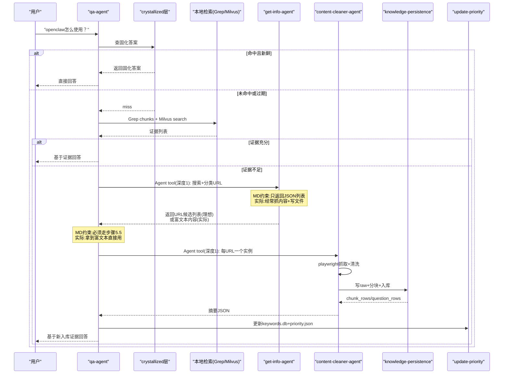
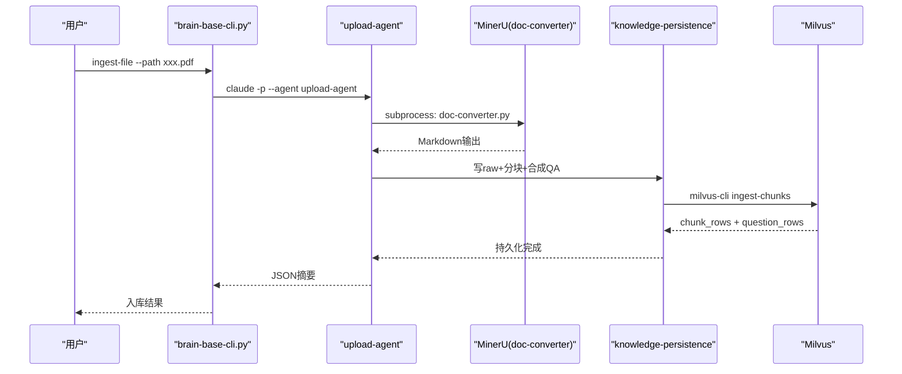
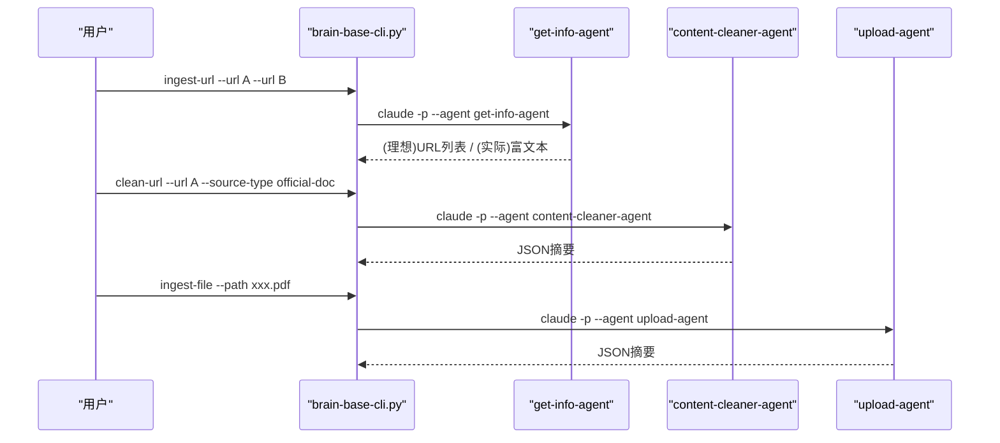
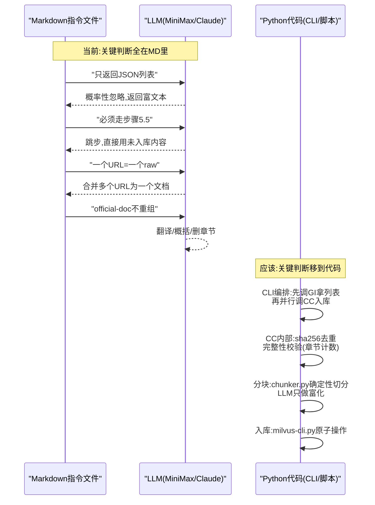

# brain-base 当前全流程

## 问答 + 补库主链路

```mermaid
sequenceDiagram
    participant U as "用户"
    participant QA as "qa-agent"
    participant CRY as "crystallized层"
    participant LOCAL as "本地检索(Grep/Milvus)"
    participant GI as "get-info-agent"
    participant CC as "content-cleaner-agent"
    participant KP as "knowledge-persistence"
    participant UP as "update-priority"

    U->>QA: "openclaw怎么使用？"
    QA->>CRY: 查固化答案
    alt 命中且新鲜
        CRY-->>QA: 返回固化答案
        QA-->>U: 直接回答
    else 未命中或过期
        CRY-->>QA: miss
        QA->>LOCAL: Grep chunks + Milvus search
        LOCAL-->>QA: 证据列表
        alt 证据充分
            QA-->>U: 基于证据回答
        else 证据不足
            QA->>GI: Agent tool(深度1): 搜索+分类URL
            Note over GI: MD约束:只返回JSON列表<br/>实际:经常抓内容+写文件
            GI-->>QA: 返回URL候选列表(理想)<br/>或富文本内容(实际)
            Note over QA: MD约束:必须走步骤5.5<br/>实际:拿到富文本直接用
            QA->>CC: Agent tool(深度1): 每URL一个实例
            CC->>CC: playwright抓取+清洗
            CC->>KP: 写raw+分块+入库
            KP-->>CC: chunk_rows/question_rows
            CC-->>QA: 摘要JSON
            QA->>UP: 更新keywords.db+priority.json
            QA-->>U: 基于新入库证据回答
        end
    end
```

## 上传链路

```mermaid
sequenceDiagram
    participant U as "用户"
    participant CLI as "brain-base-cli.py"
    participant UA as "upload-agent"
    participant MINER as "MinerU(doc-converter)"
    participant KP as "knowledge-persistence"
    participant MIL as "Milvus"

    U->>CLI: ingest-file --path xxx.pdf
    CLI->>UA: claude -p --agent upload-agent
    UA->>MINER: subprocess: doc-converter.py
    MINER-->>UA: Markdown输出
    UA->>KP: 写raw+分块+合成QA
    KP->>MIL: milvus-cli ingest-chunks
    MIL-->>KP: chunk_rows + question_rows
    KP-->>UA: 持久化完成
    UA-->>CLI: JSON摘要
    CLI-->>U: 入库结果
```

## CLI 直接调用链路

```mermaid
sequenceDiagram
    participant U as "用户"
    participant CLI as "brain-base-cli.py"
    participant GI as "get-info-agent"
    participant CC as "content-cleaner-agent"
    participant UA as "upload-agent"

    U->>CLI: ingest-url --url A --url B
    CLI->>GI: claude -p --agent get-info-agent
    GI-->>CLI: (理想)URL列表 / (实际)富文本

    U->>CLI: clean-url --url A --source-type official-doc
    CLI->>CC: claude -p --agent content-cleaner-agent
    CC-->>CLI: JSON摘要

    U->>CLI: ingest-file --path xxx.pdf
    CLI->>UA: claude -p --agent upload-agent
    UA-->>CLI: JSON摘要
```

## 问题标注：MD约束 vs 代码约束

```mermaid
sequenceDiagram
    participant MD as "Markdown指令文件"
    participant LLM as "LLM(MiniMax/Claude)"
    participant CODE as "Python代码(CLI/脚本)"

    Note over MD,LLM: 当前:关键判断全在MD里
    MD->>LLM: "只返回JSON列表"
    LLM-->>MD: 概率性忽略,返回富文本
    MD->>LLM: "必须走步骤5.5"
    LLM-->>MD: 跳步,直接用未入库内容
    MD->>LLM: "一个URL=一个raw"
    LLM-->>MD: 合并多个URL为一个文档
    MD->>LLM: "official-doc不重组"
    LLM-->>LLM: 翻译/概括/删章节

    Note over CODE: 应该:关键判断移到代码
    CODE->>CODE: CLI编排:先调GI拿列表<br/>再并行调CC入库
    CODE->>CODE: CC内部:sha256去重<br/>完整性校验(章节计数)
    CODE->>CODE: 分块:chunker.py确定性切分<br/>LLM只做富化
    CODE->>CODE: 入库:milvus-cli.py原子操作
```
